# 【简明自控】聊聊啥是自控和特征方程

# 简明自控-聊聊啥是自控和特征方程

简明自动控制——为什么特征方程如此重要。

热场视频：

- [自平衡杆-双轴反作用轮倒立摆_哔哩哔哩_bilibili](https://www.bilibili.com/video/av73904821)。
- [顶个棍子！具有主动脚轮的全向移动机器人_哔哩哔哩_bilibili](https://www.bilibili.com/video/av80707591)。
- [我自行车怎么少个轱辘啊--球轮控制系统_哔哩哔哩_bilibili](https://www.bilibili.com/video/av78229302)。
- [及其富有科技感的--桌面级旋转倒立摆2_哔哩哔哩_bilibili](https://www.bilibili.com/video/av73220745)。

**文章结构：前序->一言以蔽之->建模->时域分析->Z变换->后记**

解决问题：啥是自控？怎么建模？怎么分析？

如果中间不想看，请看一下**后记**部分吧！

## 前序

自动控制，简短截说：

- 要让家里的室灯的关和开随着日起日落自动变化，上自动控制，你看，自动控制是把曾经需要人观察然后调整到合适的事情让机器自己调整，自动运行起来，这种粗活的去人化；
- 一个电机带动履带旋转运送东西，众所周知，当运送的东西很重时，由于摩擦力会阻滞电机的转动，从而可能造成转速下降，如何让电机在不同负载时保持同一个转速，上自动控制，你看，自动控制就是人给一个设定值（比如转速、温度、角度等）然后就不用管了，机器会稳定的执行到达你的设定值，无论它受到什么阻碍；
- 以前，所有的船需要抛瞄从而在茫茫大洋中留在原地，现在的一些船，通过GPS获取自己的位置，如果船向东偏了，船上的动力会自动的将船向西挪挪使之保持在原地；
- 发射一个导弹，无论是在什么地方发射的，在深远的内陆，亦或在海上、海内和空中，都可以命中目标，因为自动控制，设定目标，导弹自己会到达目标。

以上是一些简化的描述，从以上的过程总结一下有哪些共同之处，一个能够自动控制的系统，都需要设定值，都需要获取要控制的量的实时值（对于电机，要控制的量就是电机转速，对于船，要控制的量就是位置，对于导弹，要控制的量就是飞行方向），以及一些机制或者算法，让要控制的量去自动的跟踪设定值。所谓去人化，就是这一个个机器实现了自动化。

《自动控制原理》和《现代控制理论》这两本书，我完整的翻了不下好几遍。

首先就基础的这本《自动控制原理》而言，一上来，举例和定义很抽象，然后讲系统的分类，后面满书就是纯数学的东西，直接地说，这就不是给初学者看的书，这是适合已经有基础来巩固深化的书；看完之后有的人会说，我理解和尊重科学知识用到了生产生活里面，但我不知道具体是怎么用的，这些书，让我感觉尬尬的。

这本书分为三块，线性连续系统、线性离散系统和非线性系统。离散系统与连续很类似，本文后面只讲时域到离散域转化的一种直观方法；非线性分析部分很基础，如果会了连续系统分析这部分就能看。

本文的目的，就是先不要看书，看我这篇，然后再去看书，被概念绊住，被方法卡主，被找不着方向的几率小很多。（PS.但当我写完本文回头来看，概念和数学介绍起来不是那么简单）

这期是水一期，我从头到尾给你讲一下，传递函数中的特征方程为啥那么重要，这只是自控的自洽完备的理论体系里面的一小点，且在这里碎片化的提一下，给个印象，不是高效的系统性总结，所以是水一期。

## 传统艺能，一言以蔽之

这里放个图：控制系统抽象出的结构框图（圆叉符号表示加和，控制器的描述为A（理解为放大倍数，增益或者一个函数）被控对象的描述这里暂定为1）

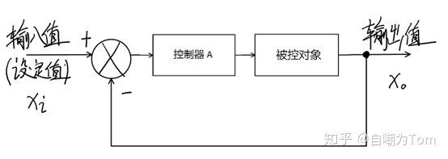

可以用公式写一下：

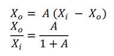

自动控制原理这门课，所要解决的**最内核**的问题，就是设计中间的那个**控制器**的内部算法，**让输出能够且更好的跟踪输入**。

要想研究，就先量化，要想量化，先定指标。

## 指标的概念

再看一个图，观察。这是两根随时间变化的曲线，一个是上图中系统的输入值Xi（虚线），另一个是系统的输出值Xo（实线）。

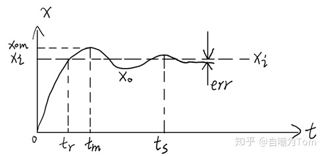

评判自控系统“优劣”的三个指标：

**稳**定性：输出能否跟踪输入，以及跟踪过程中变化的幅度；

**准**确性：输出能跟踪输入并且稳定后，两者之间的差是多少；

**快**速性：输出跟踪输入时，输出由开始到跟上，用的时间是多少。

具体量化指标即：

稳定性：稳定判据；超调量δ = （Xom - Xi）/Xi；

准确性：err（图中的稳态误差）；

快速性：tr（上升时间），tm（峰值时间），ts（调节时间）以及振荡次数μ。

总结：把一个实体系统，建立微分方程、传递函数和频率特性的数学模型，分别在时域、复域和频域三个“维度”，评价这个系统的“稳准快”性能，这本书说完了。目的就是得到“稳准快”这三个指标，初学到此足够。

这三个“维度”，就是三条路，都可以到达目的地，走哪一条都可以，区别就是对于不同的系统和目的，三条路的重要性和难易程度不同。

## 这本书

这本书：建立数学模型->微分方程的时域分析->传递函数的复域分析->频率特性的频域分析，然后简单介绍一下离散系统和非线性系统的一般计算方法，没了就这些。

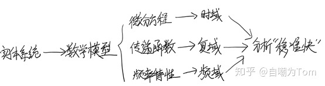

## 建立数学模型

基本模型：电容，电感。

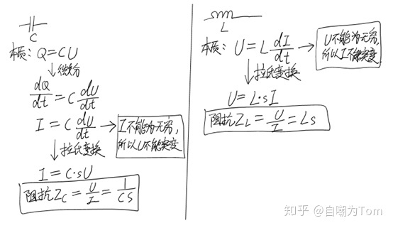

为了把微分方程写成传递函数，去掉零初始值，经过拉普拉斯变换，写成输出比上输入的形式。一次微分当成s，两次微分当成s^2，一次积分当成1/s，依次类推，怎么来的，拉普拉斯变换，降维，把积分微分符号变成乘除，有兴趣去推一推。

电路中，可以直接把电容和电感分别写成阻抗形式，然后就按照普通的欧姆定律计算即可求出该电路的传递函数，在给定输入的情况下，计算出输出，然后把输出反拉氏变换，就得到了输出的时域解，进而画出时域解的图像，或者就求导之类的计算“稳准快”。

下面举一个例子，如何写出一个系统的微分方程、传递函数和频率特性。

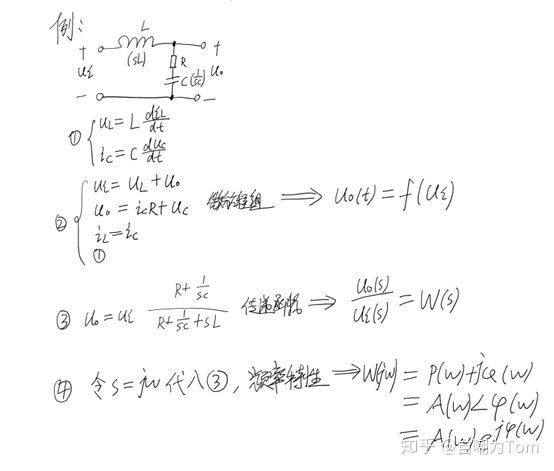

## 正片开始：分析“稳准快”指标与特征根的关系

再举一个例子，看这个电路，这次不但写数学模型，再求解一下“稳准快”指标。

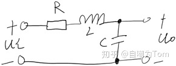

其微分方程可以写成如下形式：

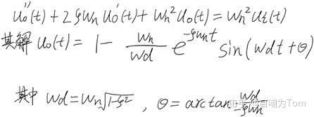

再写传递函数，先别管为什么写，写出来看看：

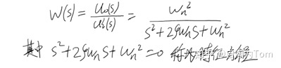

求一下特征方程的跟：

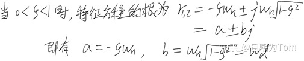

**a和b好像与微分方程的解有相同之处（全文点睛）**，将a和b带入看看：

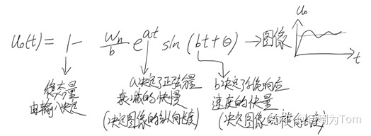

“稳准快”的具体公式：

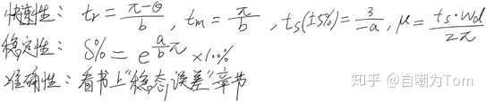

所以你看，特征方程的跟a+bj决定了系统的“稳准快”指标，即系统动态响应过程与特征跟在复平面的位置有关。对于高阶系统，同样适用。

更形象的理解，看上面的输出公式Uo（t）；a是负数，a如果变大，则Uo（t）的图像曲线会更加“陡”，如果a变小，曲线会温和平静一些，a是管“纵向”幅度的；b在正弦函数里，b变大，曲线会被往右“拉长”，反之同理，b是管“横向”拉伸的。一纵一横，这输出量的图像基本就确定了。

## 自控原理总结

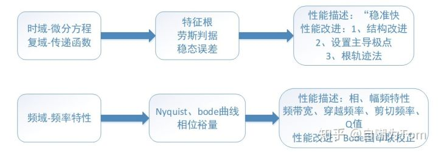

## Z变换一般方法简析

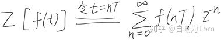

下面给出一个例子：

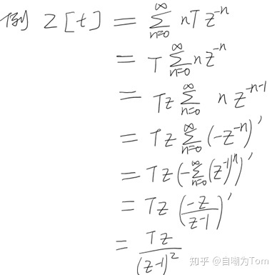

## 后记

1、上面对系统进行建模的环节都是拿电路举例，只是举例，这种数学建模思想可以直接平移用到其他系统。

2、说了那么多，那通过数学推导出的控制器，该怎么转变为软件算法呢。相比于实体控制器，这样的好处是控制算法容易修改，容易维护和部署，但缺点是速度可能比实际电路运行的慢些，考虑一下性价比。计算机是离散的，如无处不在的律动，只需把连续传函变为离散传函即可。

3、控制器花样繁多，学自动化或者自动控制，不可不了解的一种，那就是PID，现在工业现场的控制任务，这种算法用的最多，改进型的PID，也多达二十多种，易读易用。

4、让更多的人真正理解这门课的内涵和意义，本篇文字也是简单打一个样子，许多科目本来相当实用和有意思，我想传达这种精神，各位，吃喝玩乐很有意思，因为那些本身就是为了让人感觉好的，但是如果让难的事物，让更有价值的事物在保持能够给人加价的同时，也能变得有意思，这是现代社会的一种内核趋势。

5、说句题外话：我看模电，一次看的电子科大的慕课，并按照每一节知识点作笔记，然后重新梳理笔记，对于BJT，最后我总结的学习路线是由概念到等效模型，到偏置电路及其意义，再到放大电路和三种接法，最后到频率特性，可是视频课程的安排却是概念（上），偏置电路，概念（下），等效模型，放大电路，三种接法第一种，频率特征，三种接法后两种。我觉得我是按照正常人理解的顺序整理的，而视频的讲解顺序有点打乱的感觉，模电原课本更加抽象和厚重，让我觉得不光是考试的时候筛选人才，在这种环境里，其学习的过程都是在筛选。想起很久以前听的一个事，就是日本在其国注册了一些专利，由于产业需要，也要在中国注册这些的专利，给我们看日本的专利文件，念起来是一句话，但句子又长又难懂，东扯西扯，可能是翻译的缘故，但更可能的就是人家故意写的晦涩一些。

在制造技术壁垒上理所当然，但是在学习知识上，有种“我好不容易学得的，你想学也得给我难一些”，可能为人师表的不是这种心理，但是我有权利也有理由怀疑。

6、平衡车，平衡自行车，二阶倒立摆，旋转倒立摆等“神奇”的事物，都是经典和现代控制理论最直接典型的应用，生活中无处不在。应用现代控制理论建模，列状态方程，仿真和实现，现今其实缺乏这种一整套的从无到有的全过程体验和训练。

(over)
