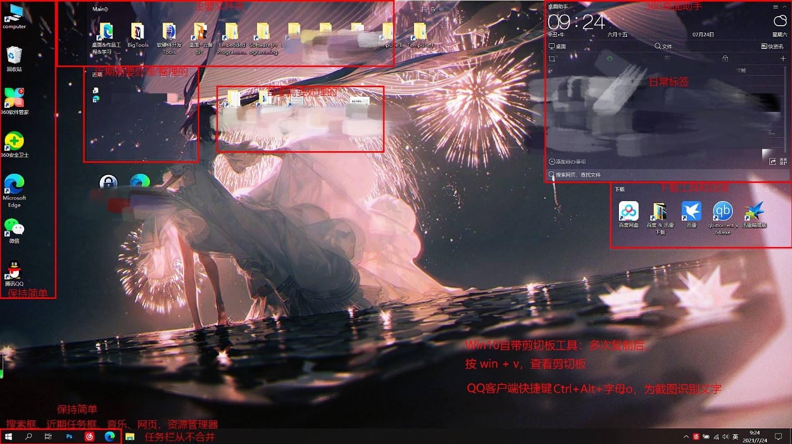
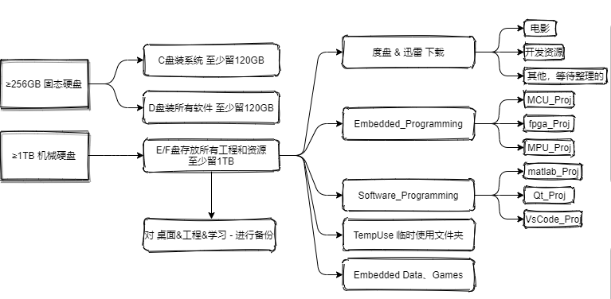
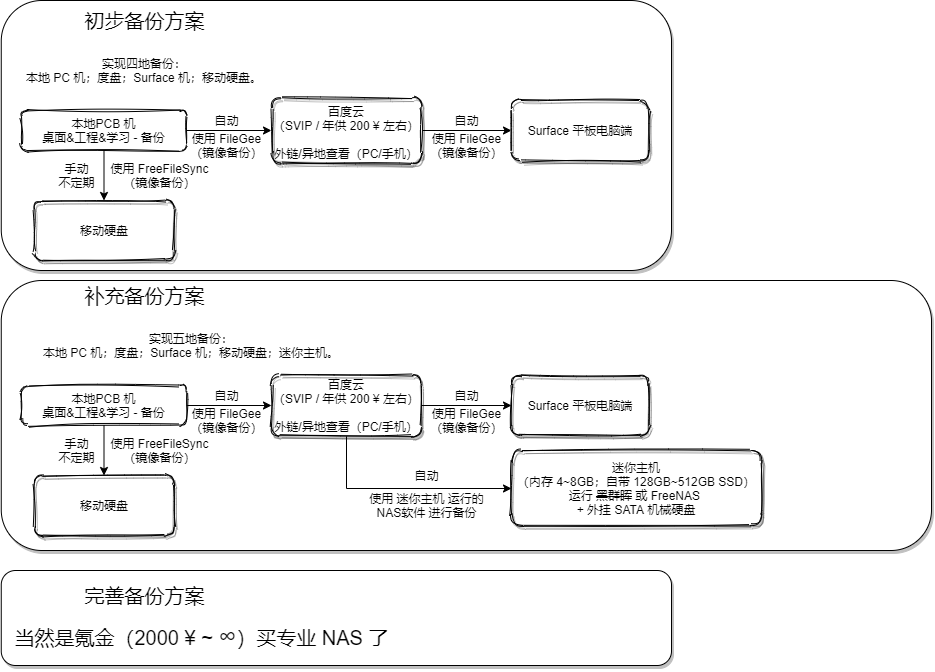

# 装机、资料库结构与文件备份方案

# 装机、资料库结构与文件备份方案

自从大约 2007 年左右第一次接触计算机到先在，经手了每个都长期使用过的五台电脑但每个阶段积累的文件和资料大都被顺利保存了下来（但是一些如初中时候做过的视频和 Flash 课件、小游戏的源文件等的感觉具有纪念意义的在历史的长河中无了）。

嵌入式领域的学科门类、资料、软件极其多样和广阔，上衔软件下通硬件的，再加上我早期又涉猎异常多的领域，早期对这方面的整理模式一直不敏感，在这几年中，资料库的划分、整理以及备份的架构逐渐形成稳定。

------

## 系统重装步骤梳理

*p.s 以下为精简的步骤，捯饬过几次装系统的很容易理解，新手还是多百度吧，反正路线放这了。*

*p.s 以下步骤是我从初中到本科反复做过 N 次的，或许有的地方过时了，或许近来又有了一些新的方法，可以评论区讨论。*

第一步。下载原版系统镜像文件（.iso）（如下链接）；制作USB启动盘，即将 U盘 当作启动盘（推荐专门装机用的启动盘制作软件，有菜单，功能多，最好带 Win-PE 系统，比如 [u盘启动盘 _ u盘启动盘制作工具 _ 系统重装 _ u盘重装系统教程 _ u深度官网 (ushendu.com)](http://www.ushendu.com/)），再将下载好的系统镜像文件（.iso）放入 U盘。

- 操作系统原版下载 [MSDN, 我告诉你 - 做一个安静的工具站 (itellyou.cn)](https://msdn.itellyou.cn/)；或者 [NEXT, ITELLYOU](https://next.itellyou.cn/)。
- PJ [最全的微软msdn原版windows系统镜像和office下载地址集锦-网络教程与技术 -亦是美网络 (yishimei.cn)](http://www.yishimei.cn/network/290.html)。（亦是 KMS 工具 下载处）

第二步。进入电脑开机的 BIOS 改启动顺序，将 U盘启动 调整为第一（这一步方法具体百度，win7、win10以及不同主板品牌的方法略有不同，思路都一样）；之后插入 U盘，重启电脑，显示 U盘启动盘的菜单，选择进入 Win-PE 系统，使用 DiskGenius 软件 改分区（分区设置还可以避开硬盘坏道，需要提前扫描硬盘确认坏道位置）；再使用 One Key（推荐）或者 GHOST 给 C 盘装入系统，接下来全自动化运行，电脑会自动安装好一切..直到进入新的系统桌面。

硬盘分区建议：

- 固态硬盘（SSD）适合经常修改和使用的空间，机械硬盘适合不常修改而偶尔查看的当作冷储存的地方。
- C 盘系统盘推荐用固态硬盘（SSD），至少留 128GB 空间。不建议分区过多，这里推荐的分区策略：如果 PC 存储 是 一个 512 GB 的 SSD 和 一个 1T/2T 的机械硬盘，那么 SSD 平均分给 C 盘和 D 盘，然后剩下的一个机械硬盘 整个 给 E 盘；如果 PC 存储是 一个 1T/2T 的固态（毕竟 SSD 国产化之后就大幅便宜了），那么 拿出 256GB 给 C 盘，剩下的容量 给 D 盘。
- 更多 分区 和 资料分类存放 的建议 见下文 `我的资料库结构` 一节，这也是本文的主要目的之一。
- 分区模式，建议：老主板（2015之前的）：BIOS+MBR模式；新式UEFI主板（2015之后基本都是）：UEFI+GPT模式。
  win10对MBR和GPT都支持，如果出现问题，先检查启动方式是不是UEFI。如果是win7，还是选传统的BIOS+MBR模式吧。
  win10只需要安装专业版和企业版就好了，前者在存储上优化，后者在安全上优化。
  所以，分区模式，先在都用 GPT，支持大于2T分区，比 MBR 更稳定，纠错能力更强。固态硬盘必须进行4K对齐。

第三步。装好并进入新的系统桌面后，按下述步骤（只是推荐）：

1. 用驱动精灵（还可以在里面的“医生”窗口里安装常用依赖框架！）或者 360驱动 把驱动补全，装 安全管家 或者 360 调整系统，清理杂鱼软件，清理垃圾，补全补丁，清理垃圾。

2. 用 @live.com 账号登陆系统，这个账号用来统一登陆 Win、Office。

3. 然后是神奇的一通注册...用 KMS 工具注册系统，再安装和用 KMS 工具注册 VOL 版本的 Office 全家桶。

4. 再安装其它软件，安装软件尽量从应用商店中（软件管家 或者 win 自带的应用商店）

   （不谈人为的坑，就是鉴于有的人只需要摔坑 1~3 次就会举一反三了，而一些人因无法分辨网页中正确的软件下载链接而在第一步就被绊住）。

~~驱动都正常后，关闭 WIN 的 自动更新驱动，这个会更新不兼容的驱动，很坑。此电脑右键->属性->高级系统设置->硬件->安装设备设置,选择“否，让我选择要执行的操作”“从不安装来自Windows更新的驱动程序软件”。~~也不一定非要做这一步。

## 我的资料库结构

首先是桌面划分。区域划分、功能要素简明全面。

PC 机 的分区以及分区类型划分。

## 文件多地备份方案

图中 “初步备份方案” 是我的截止到成文的多地文件备份方案，后边两个方案为为以后设计的两个。

如上图所示，“补充备份方案” 中使用了 NAS 相关的软件，“完善备份方案” 为最省事（氪就完了）、功能最全的。

前两个也就是不使用 NAS 的“凑活”的方案，当然不如 氪金 上 NAS 的完善，比如：快速的文件镜像备份、方便的异地查看文件和生成分享链接、添加离线下载等等。

## NAS 介绍

NAS介绍：[NAS（网络附属存储）_百度百科 (baidu.com)](https://baike.baidu.com/item/NAS/3465615?fr=aladdin)。

NAS 可以提供 异地存储/查看、文件备份、下载（BT/迅雷/磁力，PT）、手机/PC端的随时快速查看和播放等。NAS 的硬件载体是运行 Win / Linux 操作系统的小型计算机 / 服务器，或者是一个板载 ARM CA（Cortex-A）处理器的嵌入式系统。 NAS 的软件是 手机 / PC 端的进行访问和控制的主要人机界面，其载体为手机端的 APP 和 PC 端的 网页界面。

NAS 系统分为软、硬件，有两种构建，一种是直接买产品（氪就完了），另一种是用旧的不用的电脑 或者 买/自组 迷你主机 再装个 NAS 软件完事。

### 对于直接买产品

NAS 产品现主流两家：群晖、威联通，其它品牌多属于耕耘不深的入门级产品。一买即得全部功能，包括 异地/外网/远程访问。

- 群晖 [群晖 nas 有些什么基本和好玩的功能？ - 知乎 (zhihu.com)](https://www.zhihu.com/question/31480960)。
- 威联通 [从入门到入土——NAS使用全指南（威联通篇）_NAS存储_什么值得买 (smzdm.com)](https://post.smzdm.com/p/av7or4dp/)。

### 对于自己组建 NAS

软件有 FreeNAS 和 黑群晖可以选择，自备迷你主机，然后将 NAS 软件装入自备的迷你主机。爱捯饬硬件的、体会组装硬件并跑起来的乐趣的，用以下介绍和网上的教程文章做一个练练手，然后再搞专业的。

### 迷你主机选择

*这一个小节才是作者写本文的原动力。*

我不是这方面的深耕的发烧友或者经验丰富的垃圾佬（快乐淘货er），他们可以用几十块钱、几百块钱淘来市场过剩的、二手的或小众的 组件再自组一个能用 / 好用的 小电脑来 7x24 小时的挂一些东西/任务运行，其言语风格如下：

- “一个猫盘才100多，一个小主机也100多，二手硬盘100多，搞坏了不心疼”。
- “前段时间收了几个猫盘做 NAS，才 60 一个，刷的 DS120J。后来又收了几个D525和D2550小主机”。
- “呵呵，网上一大把教程。我只用来 bt 下电影，电脑、ipad、手机之间共享很方便”。
- “小主机可以 J3455，J4125，J5040，功耗都比较低。也可以用 H61，H81 等便宜、性能高的三、四代 CPU 但功耗大”。

我听不懂，但我大受震撼.jpeg

但了解了之后如获至宝。。

迷你主机可以选择 J4125（指 CPU 型号，功耗小，适合小主机），其就是一个可以运行 Win10、Linux 等系统的小计算机，性能相当于十年前的中等 CPU，但对于 NAS 算是性能过剩了（所以上面有说到 D525、猫盘和 ARM CA（Cortex-A）的相对性能低一些的处理器都已经够用了），价格 500 ~ 1k，手掌大小便携，需要外部电源，24W 功耗左右，日常文档办公足够，有多个 USB 3.0 口、单/双路网口、单/双路 HDMI 接口、耳机接口等，选个接口丰富的。

也可以选择更多其它，淘！

另外就是作为长期存储的硬盘的选择。

- 首先移动硬盘不允许长期运行，连续长时间工作容易挂掉。
- NAS 专用盘，如希捷的酷狼（群晖对希捷酷狼4T及以上的硬盘有专门的优化），西数的金盘（企业盘）。

### FreeNAS

NAS 软件有个开源的 FreeNAS（FreeNAS 现已和 TrueNAS 合并到 TrueNAS）。

- [TrueNAS Open Storage | ZFS for the Home to the Data Center - TrueNAS Open Storage | ZFS for the Home to the Data Center](https://www.truenas.com/)。
- [FreeNAS中文网 | FreeNAS技术交流](http://www.freenas.com.cn/)。
- [如何利用FreeNAS自行搭建可以被远程访问的NAS？_u012435915的博客-CSDN博客_freenas外网访问](https://blog.csdn.net/u012435915/article/details/81953675)。
- ...

### 黑群晖

网络上 群晖 DSxxx 的引导文件和固件 写入自备的 迷你主机。

- [黑群晖NAS保姆级教程：手把手教您安装DS918+固件，开启显卡解码功能！3分钟玩转黑群NAS!_NAS存储_什么值得买 (smzdm.com)](https://post.smzdm.com/p/ar0v2on7/)。
- [[黑群晖经典教程\] 一步一步建立自己的黑群晖 - “人生苦短” - 博客园 (cnblogs.com)](https://www.cnblogs.com/hester/p/4988755.html)。
- [黑群晖组建指南 篇十一：大男孩的快乐：垃圾佬入坑群晖指南_NAS存储_什么值得买 (smzdm.com)](https://post.smzdm.com/p/apz3omn9/)。
- ...

## 最后

有一点，上面说到的 “自己组件 NAS” 都不能在远程访问，仅限于局域网访问，外网访问需要用到别人的服务器，当然是需要花钱的；也有人说 “不能远程访问的NAS不叫NAS”，确实，如果想，直接买 群晖 或 威联通的产品 氪就完了；不过也有 自己买公网 IP 或者 让中国电信 分个 IP（三大网络服务商只电信可提供 公网 IP）再买个域名，来让自己的 NAS 系统可以做到外网访问（不过暴露于公网的自己的 NAS 系统的安全性我也怀疑难有保障）。

就上上面 “文件多地备份” 一节里说到的 “补充备份方案”，我设计的备份路径是 本地资料镜像备份至百度云SVIP，然后迷你主机再通过百度云来备份到本地，同时在外网可以通过访问百度云来实现上一段所说的 “远程访问”。

怎么样，如果你想仅仅为了文件备份和局域网共享（其它花里胡哨的功能嘛...暂无需求），比较以上网友的 “自组 NAS” 方法 和 我的 “备份方案”，通过 性-价比的比较，你又做何选择呢？

