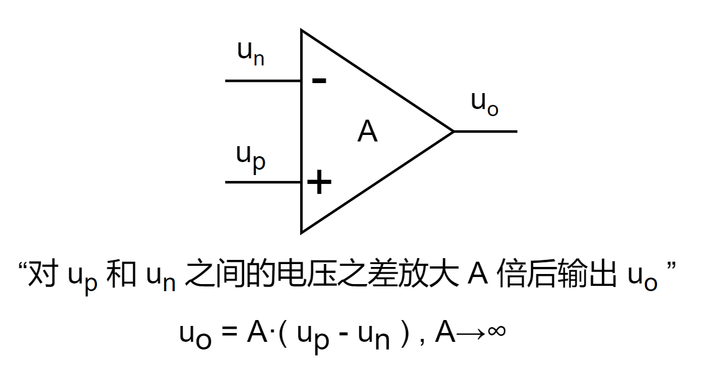
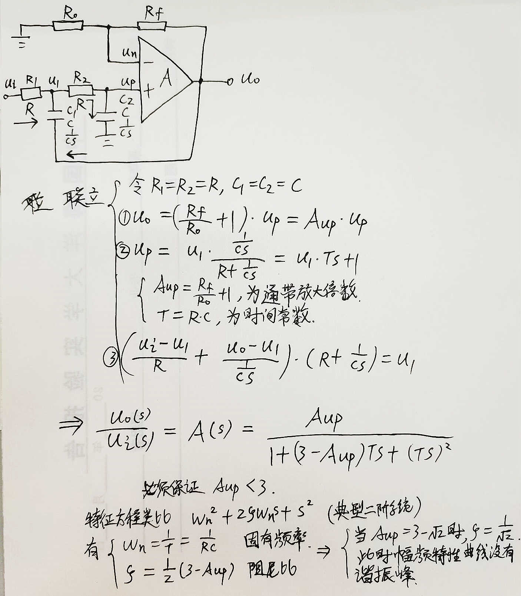

# 手撕运放-运放的第一原理性定量分析法

# 【手撕运放】运放的“第一原理”式定量分析法

数电/模电那两本书我也完整地翻过一、二遍（诶我为什么用“也”），下面就是来点不复杂的（如果是那还不如直接把书的内容粘过来呢）。

对于运放的定量分析，“虚短虚断” 就如同 “奇变偶不变” 一样喜闻乐见的普及，但是对于什么时候用 “虚短”，什么时候用 “虚断”，学习的时候一开始并不能准确拿捏，因为 掐头去尾 啪的一下给出各种 推论、结论，使人被动的认知障碍了。实际上，“虚短虚断” 就是从“放大倍数趋于无穷的极限计算”得来的两个“推论”，“放大倍数趋于无穷的极限计算”也就是本文要介绍的方法，这种“第一原理性”的分析方法可以以不变应万变。

本文中用到的 电路拉氏变换、传函、幅频特性计算等等，与 “自动控制原理” 里面的方法相通，可以先看 这篇文章 [【简明自控】为什么特征方程如此重要 - 知乎 (zhihu.com)](https://zhuanlan.zhihu.com/p/115199985)，这里面均有陈述。

------

## 理想运放的本质

给我一个理想运放：

理想运放的功能，**就是对 up 和 un 之间的电压差放大 A 倍后输出 uo**，即 uo = A·( up - un ) , A→∞。这是本质，这是核心公式。

好了本文结束了。

.

.

.

什么？还要我举例手推，好吧~

## 举6个栗子

- 同相比例放大；
- 差分放大；
- 反相比例放大的T型接法；
- 二阶有源低通滤波电路；
- 压控电压源二阶低通滤波电路；
- 一种线性电源拓扑的可控电流源。

我选择的也是有目的，这几个电路相当实用。以下一一道来。

### 同相比例放大

对于理想运放来说，放大倍数 A 为无穷大，整理出带有 A 的 uo/ui 的式子之后，只需一个 A→∞ 求极限，即可求出 该电路放大倍数的表达式。

下图给出运放的“同相比例放大”接法，以及使用“uo = A·( up - un ) ”来求解的过程。

要记着运放的两个输入端的输入电阻相等的条件。这样使得运放的两个输入端的输入（静态）电流一致，减弱由运放内部的偏置和温漂产生的差模输出，确保 ui = 0 时， uo 也为 0（理想时）。下图说明（“//” 符号为并联）。

### 差分放大

计算过程，一样的，先求 un 和 up，然后带入 核心公式 “uo = A·( up - un ) ”，再求个 A → ∞ 极限，得出结论。

电路和仿真结果（Multisim 仿真）在下图。正输入为 25Hz 的 -5V ~ 5V 的正弦波（橘线），负输入为 1Hz 的 -5V ~ 5V 的正弦波（红线），输出为蓝线。可见，实时的，橘线电压减去红线电压（即橘线电压进行上下偏移）再 1/2 倍得到蓝线，图形有点漂亮吧。

### 反相比例放大的T型接法

反相比例放大的T型接法，小阻值电阻实现高倍数放大（使用大电阻的缺点是容易受到外接电磁干扰，阻值越大，外界电磁干扰的感应电流所引起的干扰电压越高）。

电路、分析和仿真结果均在下图了（列方程组后的手动整理工作量很大，所以用 matlab 帮助进行带符号方程组的整理工作，很方便）。

下图阻值选择，简单做了 uo/ui 为 -2 倍的信号调整/调理，示波器中红色线为输入，橘色为输出。

### 二阶有源低通滤波

简单二阶有源低通滤波电路，即两个 RC 一阶低通滤波串起来。

计算电路的传递函数从而得到其幅、相频率特性，对电路先进行拉氏变换，然后类似欧姆定律求其传函，再求得幅频特性，令幅度等于 0.707（1/√2，即 -3dB（ 20lg0.707 ≈ -3dB），幅值下降到 0.707 的频率认为是截止频率）求出截止频率，约为 0.374 倍的 1/2πRC，在10kHz的时候衰减倍数约为 0.0298，下面进行仿真。

伯德图分析，-3dB 时候 约为 592 Hz，与上图中的计算较拟合。

9.918kHz 的时候约为 -32.506dB，10kHz 的时候的理论值为 20lg0.0298 ≈ -30.51567dB，较为拟合。

### 二阶压控低通滤波

又可以叫压控电压源二阶低通滤波电路（名词的各种换位置组合。。），通频带内最平坦的一种滤波电路，属于巴特沃斯滤波器的一种。

由 R1、R2 和 C1、C2 分别构成两个一阶低通滤波，但 C1 原本的接地端接 uo，引入电压正反馈，形成压控滤波器（书面表达）。

电路、简单计算过程均在下图。

仿真。按照下图的 R、C 参数，可以计算 截止频率约为 2.1kHz，在 10kHz 处的衰减倍数约为 0.0379，通过仿真可以验证均拟合。

### 一种线性电源拓扑的可控电流源

该电路为类 LDO 原理的线性拓扑，靠功率管来分压而动态调整输出到目标位置，线性电源的效率不高（相比较开关电源而言），电流不宜过大（适合小于 1A 的场景），若要大电流的恒流源还得上开关电源。我的一个开源电源项目 [【开源项目】叠buff电源板-巧克力板 - 知乎 (zhihu.com)](https://zhuanlan.zhihu.com/p/357497672)，其实现了恒流恒压可调。

电路和分析均在下图了。其中 PNP BJT 可以换为 P-MOS，门级（栅极）电阻不要太大。

从负反馈的角度理解。R5 为测电流的反馈电阻，当电流 Ic 变大了，R5 两端电压上升，up 端电压就会减小，从而运放的输出电压减小，从而输出电流 Ic 减小，若 Ic 变小了，则 up 会变大，从而 Ic 也会变大，形成动态平衡。从外界来看，即 Ic 跟踪 ui。

## 尾记

1. 这里是演示对于运放从“第一原理”角度理解、推理和验证，从推公式过程也可见对于复杂的电路计算量较大，该法用于学习和定量分析，实际用的时候不用重推，记下结论公式即可。
2. 本文章介绍的这个用“极限”的方法是我学模电的时候想的，还不用“虚短虚断”法而饶有兴趣的用此法对上述的电路都手推了一遍，与正确结论一致，并且还能推出“Rp=Pn”的条件。我自己常用本文的方法而不用 “虚短虚断”，手算是用于初步分析和应付考试，实际中用的话效率很低（手算计算量大），记住各种电路拓扑和结论公式也是为了见到新电路时的初步的定性分析，原理明白后设计时最好还是用仿真软件加以辅助和验证。
3. 滤波器那里计算传递函数、画伯德图、求 -3dB 处频率、求谐振峰值及谐振频率、求 滤波器的品质因数 Q 等等这些，完全可以用 “自动控制原理” 里面的方法来做，模电书上提供的某些带有 f 和 f0 的求传函和幅频特性的方法可能属于是工程计算上的习惯法，掩盖了很多细节，还是学/用更基础的、底层的拉氏变换更好操作。更多阅读 [【简明自控】为什么特征方程如此重要 - 知乎 (zhihu.com)](https://zhuanlan.zhihu.com/p/115199985)，也许会给你带来许多启发，打通不同的学科。
4. 上面电路均有很丰富的应用场景，比如信号调理（包括比例放大、偏移）、信号求和/求差运算、高边测电流、信号滤波等等，基于几个简单的拓扑而变化多端。
5. 运放的用法总结：
   - 正反馈接法：比较器、振荡器。
   - 负反馈接法：比例、求和/求差（或偏移）、微分/积分、滤波。
6. 运放的基本参数：可见我的硬件规范里的 [thoughs-about-hardware-design/SCH & PCB 设计规范和 AD 的使用.md at master · Staok/thoughs-about-hardware-design——运放小节 (github.com)](https://github.com/Staok/thoughs-about-hardware-design/blob/master/SCH %26 PCB 设计规范和 AD 的使用.md#运放)。

