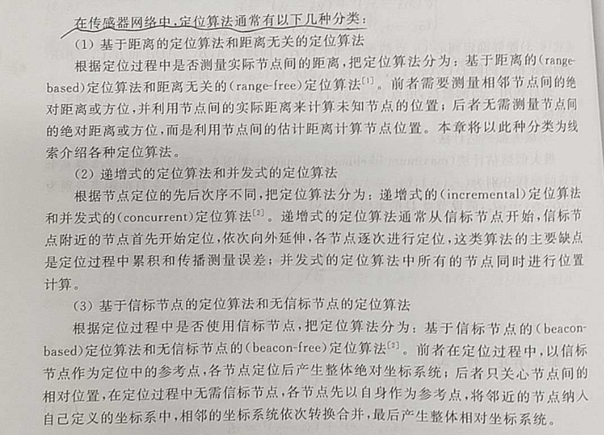
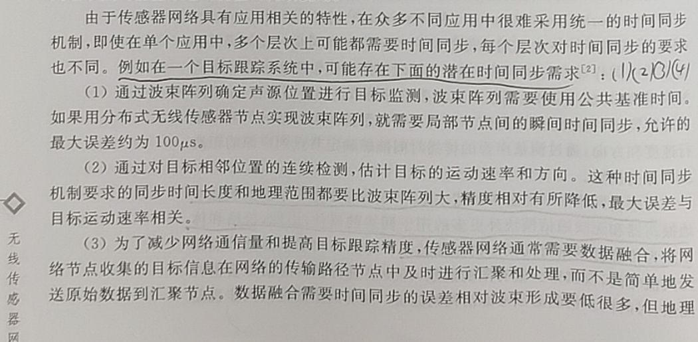
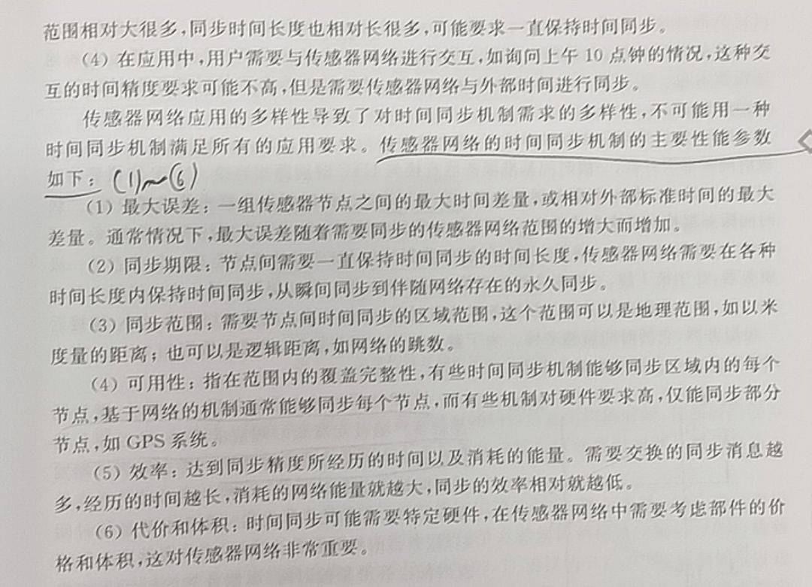
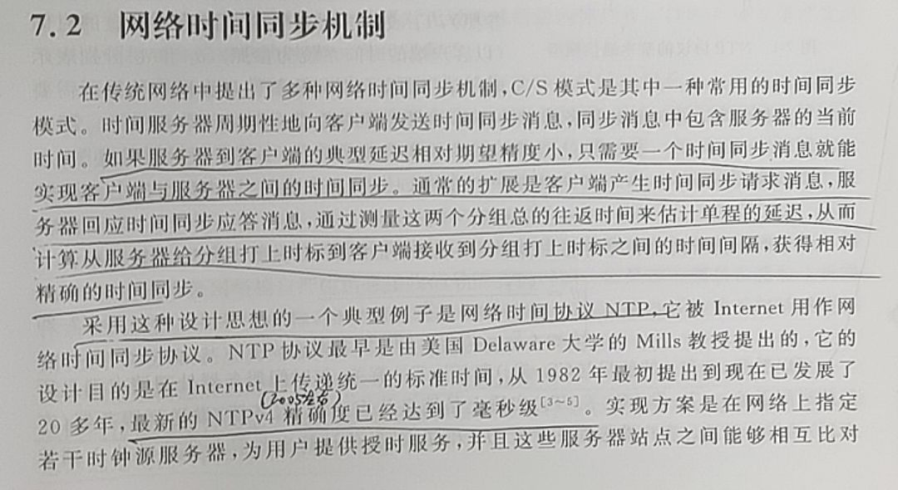
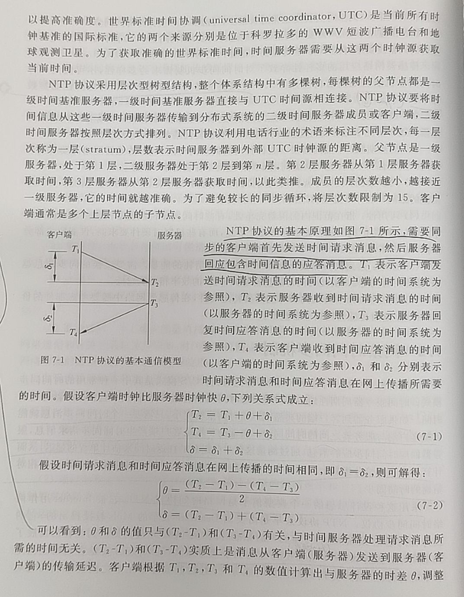
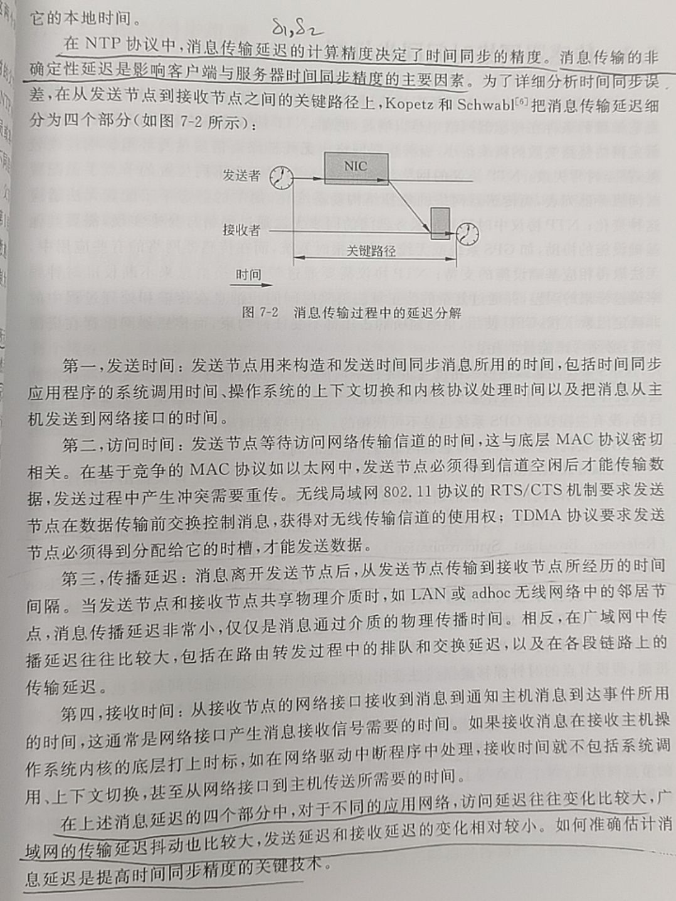
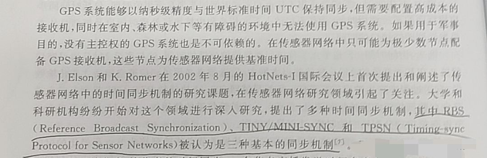

# 无线传感网络的定位和时间同步技术简述

# 无线传感网络的定位和时间同步技术简述

只记一些概念。都是在 2005 年的《无线传感网络》一书中摘取，基本概念可以了解，但具体方法在用的时候还需要再查阅最新的综述文献和书籍，再看新方法。这里的无线传感网络，即在一定区域内多节点分布式的分布且通过无线通讯方式而组成传感网络的范畴。

------

## 定位技术

随机布放的传感器节点无法事先知道自身位置，因此传感器节点必须能够在布放后实时地进行定位。传感器节点的自身定位就是根据少数已知位置的节点（信标节点），按照某种定位机制确定自身的位置。

多传感器协作。定位信息还有以下用途：目标跟踪（实时监测和报告）、预测目标轨迹、协助通讯的路由等。

传感器网络的定位算法通常具备以下特点：

- 自组织性，节点随机分布，不依靠全局的基础设施协助定位。
- 健壮性，节点硬件配置低、功率小、可靠性较差，算法需容错性高。
- 节省能量，算法对于无线通讯、处理器的计算的能量消耗要控制好。
- 分布式计算，每个节点计算自身位置，而非由某一个节点对其它多个节点进行计算。

再无线传感网络中，信标节点（已知自身位置）和未知节点（已经接入系统但自身位置未知），信标节点占少量，其可通过自身携带的GPS等定位设备获得自己精确的位置，未知节点通过信标节点的位置信息来确定自身位置。一开始信标节点很少只有几个，但其临近的节点不断定位自身之后也可以转换为信标节点，后续节点接着定位和转换为信标节点，传播遍及整个无线传感网络。

三种基本方法：**三边测量法**（用三个信标节点到一个未知节点的距离）、**三角测量法**（用三个信标节点到一个未知节点的角度）、**极大似然估计**（用 n 个（n ≥ 3）信标节点到一个未知节点的 n 个距离信息，个这 n 个信标节点的自身的位置坐标，建立 n 个方程组成方程组，用最小二乘或极大似然估计（广义逆矩阵）求解该未知节点的估计坐标）。

三边测量法是分别以三个信标坐标为圆心和其到一个未知节点的三个距离画三个圆，圆的交点便是未知节点的位置，但实际距离的测量（用 TOA（到达时间法）、TDOA（到达时间差法）或 RSSI 法（通讯信号强度法）等）并不精确从而使三个圆有一个相交的一片区域，可以用此法估计：任意两个圆的交点确定一个直线，找两对圆得到两个这样的直线，两个直线的交点便是未知节点的估计位置。

还有一种**双元检测法**，该法中，传感器的距离检测只有 1 和 0 两种状态，侦测距离 R，对于 R - e 距离以内的目标一定检测为 1（有，在范围内），对于 R + e 距离以外的目标一定检测为 0（无，不在范围内），那么密集的该传感器分布在一定区域内，未知节点即在这些检测重叠范围内。优点是硬件要求低，缺点是需要比较密集才能保证检测精度、还需要时间同步和信标节点需求多。

定位算法的几种分类方法：

这里主要以上述第一种分类方法来说明。

### 距离有关定位算法

两个阶段，先测距，再定位，后者就用上述的三边、三角和极大似然估计，前者就是下面所说的。

对硬件要求、功耗要求、小巧、造价等，都要考虑。

- TOA（到达时间法）：假设两个节点时间同步，一个节点发送带有发送时刻信息的通讯帧到另一个节点，另一个节点通过发送和接收的时差确定二者距离，要求是时间同步的精度要高，信息打包、发送、传输、接收和解析的时间还有在空中的传播的速度都要比较精确（定位精度需求小的场景对这些要求会很宽松）。
- TDOA（到达时间差法）：一个发射节点同时向两个节点发送两个不同传播速度的无线信号（如一个无线电，一个超声波），接收节点可以利用两种无线信号的到达时差来确定距离。或者，一个发射节点同时向两个不同距离的节点发射无线信号，两个接收节点需要时间同步，再根据接收时延确定距离。
- AOA（基于到达角度）：同上述三角测量法。
- RSSI 法（通讯信号强度法）：通过接收信号强度来估算距离，两种，利用信号传播的经验模型（多试、求拟合函数，或建立位置和信号强度的数据库），利用信号传播的理论模型。实际中，该法受环境的温湿度、障碍物、传播模型等影响很大。
- 等。

### 距离无关定位算法

该类方法精度低，但是对硬件需求较小。

两种，一种是估计距离（通过算法，而非实际测量），另一种是估计出未知节点的一个位置范围区域，然后取该区域的质心（坐标的平均）作为未知节点的位置（典型的就是上面说到的 双元检测法）。

主要有 DV-Hop算法、Amorphous 算法、APIT 算法等。

用时再研究。用时还需查阅最新的综述文献和书籍，寻到更新的更先进实用的方法。

## 时间同步

不同节点有自己的本地时钟所计数的时间，每个节点有不同程度的时钟漂移而造成时间偏差，需要进行多节点的时间同步（单次或周期性地）。

需要时间同步需求的场景，以及时间同步的性能参数/指标：

网络时间同步机制，典型的是客户端“要时间”，服务器发一次时间，客户端接收到时间同步信息后，根据自身时间和一些传播时间的参数得出要修正的时间。

### 网络时间协议 NTP 的基本原理

NTP 中，消息传输过程中的延迟的精度决定了时间同步的精度，延迟主要分为四个部分，以下细分析：

### 无线传感网络的时间同步机制

三种基本的同步机制：

参考广播同步（RBS）机制利用无线数据链路层的广播信道的特性，一个节点发送广播消息，多个（至少两个）接收到广播消息的一组节点相互比较各自接收时间的本地时刻（交换），实现它们之间的时间同步（是它们之间的，不是它们与标准时间的同步）。

其它机制用时再研究。用时还需查阅最新的综述文献和书籍，寻到更新的更先进实用的方法。
