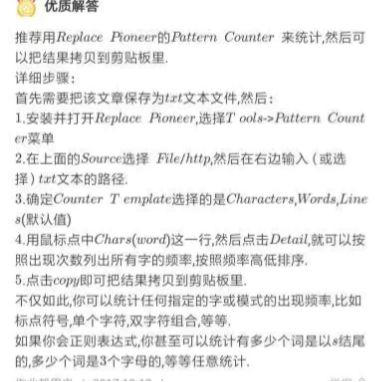
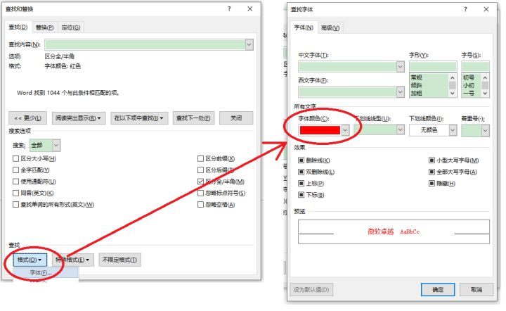
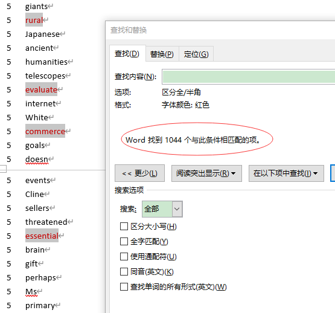
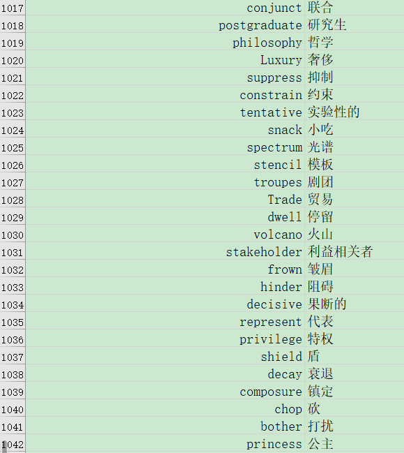

# 抓考研英语单词主要矛盾的经验分享，考研英语真题词频统计

# 抓考研英语单词主要矛盾的经验分享，考研英语真题词频统计

### 按

[这篇考研经验总结文章](https://zhuanlan.zhihu.com/p/235480366)提到过，我自身对于一个英文句子如果单词都认识那么大概率可以自然翻译出来（大概是得益于看英文电影（偶尔不带翻译字幕）和英文芯片手册多的原因培养了语感），所以主要矛盾是单词，那么考研英语的单词是有限的，我在想数十年的考研英语真题会不会有一部分词的频率会非常高而且我不认识呢？把这一部分找到并记住，那估计就能达到事半功倍的效果。有人会说很多考研英语大V都总结了高频词汇，我看过了...不知怎的，我觉得我要亲自给历年所有真题的词汇排个序看看长什么样。因此我找到了十几年的英语真题并对所有单词的频率做了一个排列，当这个列表出来的时候，我心里就有谱了，过一遍这个感觉比背数千个考研词汇感觉较踏实（或省事儿，果然懒是第一生产力。但背这个表的这个途径是我个人的感觉和想法，不代表所有人），这里分享一下当年（2019秋天）做这个列表的过程。

直接拿结果（1986-2019考研英语一/英语二真题 + 软件 + 词频统计结果）：链接：[https://pan.baidu.com/s/1QUho1dUEBYfKHYQcyiRvdA](https://link.zhihu.com/?target=https%3A//pan.baidu.com/s/1QUho1dUEBYfKHYQcyiRvdA) 提取码：XHYQ。

### 步一：收集全部文本

找到所有真题。

大部分是 .pdf 文件，用 Adobe Acrobat 一个一个文件 做识别 并 复制-粘贴 所有文字到一个 word 文档里。

关于 PDF 文字提取：

- 国内很多 PDF 浏览器带付费功能的 pdf 转 word，氪金玩家可以忽略后面的方法；
- 使用 Po解版的 Adobe Acrobat 可以直接导出 PDF 的文字；
- 个别免费/Po解的 小型 OCR 软件来提取一小部分文字；
- 百度网盘 SVIP 提供此功能；
- [一款被严重低估的PDF阅读器，含多项实用功能：PDF-Xchange editor 9.0](https://link.zhihu.com/?target=https%3A//mp.weixin.qq.com/s/FZQiZQv_qu9Vn-Nui6Bhkg)；
- [PDF 补丁丁简介 - PDF补丁丁 - 博客园 (cnblogs.com)](https://link.zhihu.com/?target=https%3A//www.cnblogs.com/pdfpatcher/archive/2011/02/25/Index.html)；
- 等等。

### 步二：词频统计

词频统计，word 竟无此功能，查到 Replace Pioneer 软件可以做到词频统计：

- 引用 [推荐一个好用的统计词频软件：replace pioneer - 简书 (jianshu.com)](https://link.zhihu.com/?target=https%3A//www.jianshu.com/p/6928b711c11c)：

- 引用 [Replace Pioneer 统计单词出现频率 - 知乎 (zhihu.com)](https://zhuanlan.zhihu.com/p/23442106)：

> Replace Pioneer是一款与众不同的专业文本批量替换和处理软件。
> 它的强大可以简单概括为：给定任何纯文本文件，二进制文件甚至网页地址，只要你能描述清楚转换规则，就能得到任何需要的结果文件。
> 虽然Replace Pioneer主要是一个文本替换工具，但是它衍生出来的功能几乎覆盖了纯文本处理的任何一个角落，而且在任一领域，它都有独到之处。
> 我常常用它来统计单词出现的次数。
> 操作方法:打开菜单栏的Tools->Batch Runner

- 官方教程：[Replace Pioneer Demo -- Count_and_statistics (mind-pioneer.com)](https://link.zhihu.com/?target=http%3A//www.mind-pioneer.com/replace/page_demo.html%3Fhttp%3A//www.mind-pioneer.com/services/Count_and_statistics.html)。

### 步三：浓缩

统计之后得到一个 词频统计列表，很长，word 有184页，截开头一部分如下图，左边是词频，右边是单词：

这个表 我没事的时候就刷，快速的从头到尾 **把 其中的生词 用红色标出**，为了单独提取出来，如下图举例：

然后在 word 中 查找->高级查找，再按如下操作，来查找所有字体颜色为红色的部分。

查找完后会选中所有红色标记的单词，就是生词，有 1044 项，这些目前都是被选择的状态，可以直接 复制-粘贴 到一个新的文档。

接着，可以全部粘贴到 excel 里面（共一列），然后可以丢给 百度翻译，得到 一列 的 翻译结果，然后再 复制-粘贴 到 excel 的第二列，得到如下表（截最后一部分）（翻译只是给个提醒，有些词是多意思的）：

得到这里最适合自己的精华，背就完了！

.

全部资料：1986-2019考研英语一/英语二真题 + 软件 + 词频统计结果

链接：[https://pan.baidu.com/s/1QUho1dUEBYfKHYQcyiRvdA](https://link.zhihu.com/?target=https%3A//pan.baidu.com/s/1QUho1dUEBYfKHYQcyiRvdA) 提取码：XHYQ

--来自百度网盘超级会员V4的分享

### 最后

当然，以后遇到的生词啊和需要用到英语的地方，该内化的是迟早要内化掉的（内化：即想即来的听说读写）。

做事不局限于表面，而是想这件事儿的根本在哪，抓主要矛盾，抓住底层关键起作用的少部分东西去解决，而比生硬的解决（比如记忆力好的人可以靠全背下来这种暴力穷举破解（如穷举法破密码）方法）要高效很多，有点儿像第一原理的方法论，其实，不管做什么事儿都可以像做科研一样调研呀。甚至可以反复品读和验证自然辩证法和其中的方法论模式思考问题，太强了（想回顾一下过去十几年学的所有政治课本，感觉全是宝库）。当设计和路线完成之后，其实会发现最缺的就是，时间，时间。
