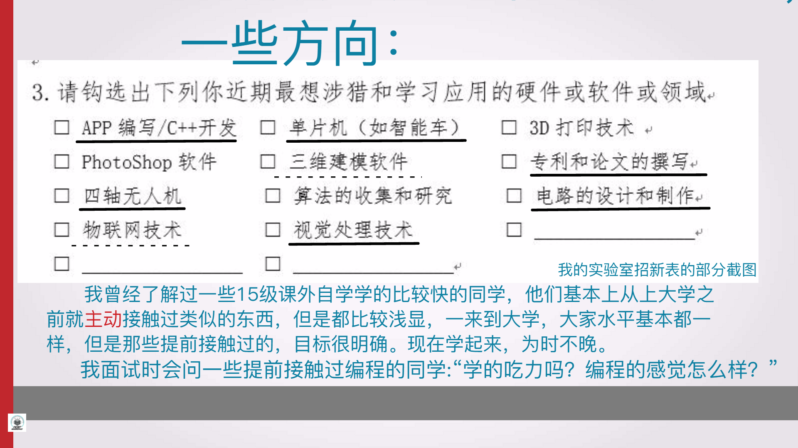

# 新生工程导论讲座PPT-17.11.23

大三，时间 2017.11.23。PPT 使用 锤子演示 制作，动态立体旋转的切图效果很赞。同另外几个同学一同受以升老师邀请专门分享一些学习、比赛经验。主要分为两个部分，第一个部分讲一个刚做完的比赛，第二部分是主体：学习、比赛经验分享。

------

## 第一部分：讲一个当时刚做完的比赛

（该项目在2017暑假获得：国家发明专利 和 大学生节能减排大赛国一奖）

------

## 第二部分：学习、比赛经验

------

# 当日的纪念...

