# 第二次创客沙龙暨平台联合探讨会PPT-18.5.12

大三，时间 2018.5.12 晚，于创客空间实验室。主动发起开一次各个实验室、各个学科的交流会，专门做了请柬邀请以升平台十几个实验室各派代表前来参会。

当时写了 旁白 来辅助讲解PPT内容，但是可能做的时候思索快于记录，导致旁白写的比较抽象和发散（其实整个PPT都很抽象...），现在我也不能100%看明白，只是尽量原文粘贴过来。

------

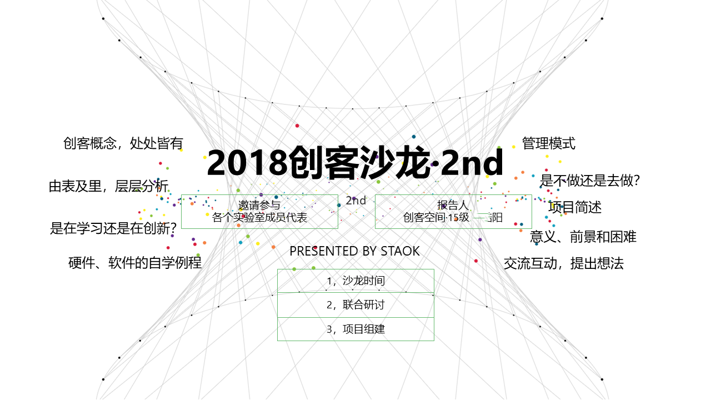

PPT 旁白：

在沙龙开始之前，首先感谢各个实验室的萌新和大佬前来参加这次沙龙会议（鞠躬）

举办这次会议的机缘巧合，是三件事情遇到了一块：

1 我们创客又到了每月一次的沙龙时间（以前都是内部开）

2 以升平台，我认为，是我们学校的亮点之一，鉴于我校有时候各个部门各个实验室之间比较缺乏联系互动，信息不是很流通，斗胆，尝试这么一次联合沙龙的形式。

鉴于这里可能有各个实验室的成员，有大佬有萌新，如果我有讲的有不合适的地方，随时，直接指出哈

3 有一个关于平台的大项目需要组建队伍和开启连年传承开发的模式。

------

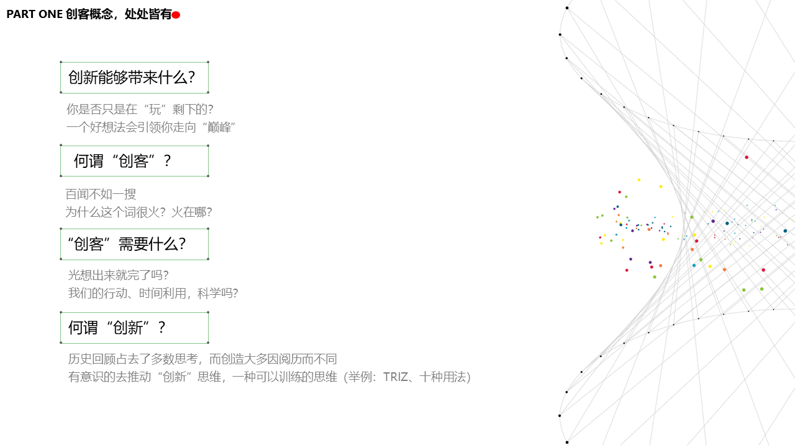

PPT 旁白：

思考的问题。

我们是否一直在玩剩下的：参加比赛、做作品 很大重复性

并没有什么改进啊，创新啊

好想法的重要性：节能减排比赛，一个大一的，好想法，国一

要么有一个好想法，如果没有，大多数人也没用，就去学点什么，学多了，创意啊比赛啊就都来了。

所以有两个分支，顺着好想法不断做下去，学好自己想学的东西。

百闻不如一见：一会放视频，并不是给创客空间做广告啊，而且要说，创客概念，处处皆有，处处可以拿去用。

很火：小含义是好像是一群做东西的人，大含义，是一会视频里介绍

创客需要什么：放视频。视频链接：[创客教育简介-腾讯视频 (qq.com)](https://v.qq.com/x/page/t0352crbaxo.html)。

创客不仅仅培养动手能力，而且培养创新思维，团队意识，项目统筹规划等等能力，也是企业需要的能力。

------

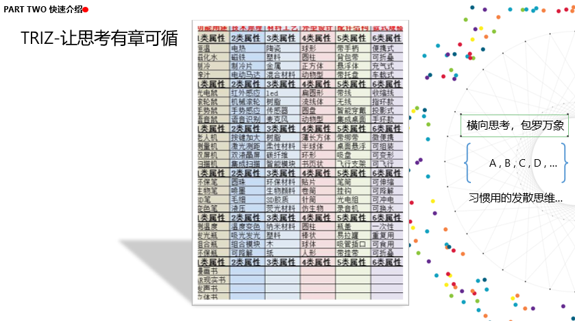

PPT 旁白：

> **TRIZ故事12——古塔是否在下沉**
>
>   城市的中心广场有一座古塔，似乎在逐渐下沉。名胜古迹保护委员会前来测量研究这个古塔的下沉问题。测量的第一步是要选择一个高度不变的水平基准，并且在塔上可以看到这个基准以便进行比较测量。
>
>   很可能广场周围建筑也在一起下沉，所以需要寻找一个远离古塔而且高度不变的基准，最后他们选择了远离古塔1500英尺以外的一个公园的墙壁，但古塔和公园的墙壁之间被高层建筑物遮挡住了，无法直接进行测量。 
>
>   ……
>
>   突然，TRIZ先生出现了。 
>
>   一个基于等势原则的方案呈现了。
>
>   拿2根玻璃管，一个安装在塔上，一个安装在公园的墙壁上，用胶管将其连接起来，然后灌入液体，就组成一个水平仪，两只玻璃管中的液体应保持同样的高度，我们在玻璃管上标出这个高度。如果古塔下沉，则塔上的玻璃管内液体会升高。
>
> 
>
> **TRIZ故事3——巨大的过滤器**
>
>   一家工厂获得了一个大订单，产品是一个圆柱形过滤器，圆柱的直径1米，长度2米，轴向均匀分布直径为0.5毫米的密密麻麻的很多过滤通孔。
>
> 工程师们看到图纸后都惊呆了，每个过滤器要加工出成千上万个轴向小孔。 
>
>    “显然，钻这么长的小孔是不可能实现的，也许可以用高温铁针来扎出这些孔，”一位年轻的工程师毫无把握地说道。 
>
>   这似乎是一个无法解决的难题。
>
>   ……
>
>   突然，TRIZ先生出现了。
>
>   “我们既不需要钻床，也不需要铁针，这件事应该这样来考虑……”
>
>   随后，一个基于局部质量原理的解决方案展示了出来：
>
>   将过滤器的功能进行分解，其主要构成元素是过滤孔和基体，有用功能的元素是过滤孔，即过滤孔是有用的局部质量。每个过滤孔不就是一条管子吗！ 
>
>   用细圆棒做原料，然后捆扎起来，而圆棒之间的空隙就形成了过滤孔，也可以实现过滤器的功能。  

------

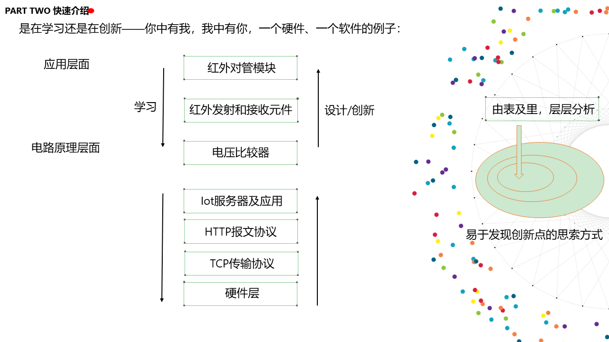

PPT 旁白：

对于同一个东西的学习，不同的人学到的不一样，会用是一回事，知道原理是一回事

就比如：

萌新对一个电子模块的学习，我们学硬件的指标是，能够自己简单造一个模型，需要一直分析，到电路实现层面，

这样不论是做项目还是做理论，

对于不同的人，所产生的成果是不一样的。

再看下面那个物联网简单入门的例子：

一条线钻研下去，再回头顺一遍，很多看似复杂的事情，通过分层和拆解，还是很好理解的

有了这样的学习方法，那么对下面的项目的制作和学习会比较快。

------

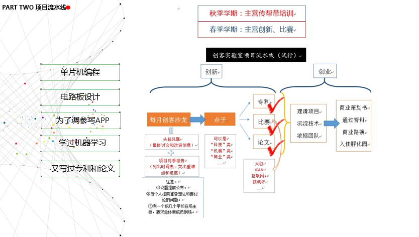

PPT 旁白：

其实有时候，

对于拿奖多的人，不是为了拿奖儿比赛，

第一个，人家是参加自己喜欢的

第二，自己闲不住，总想做点事情

第三，学习自己喜欢学习的，顺便参加比赛拿拿奖

我们画了这么一个图，也是想说，成为一个多学科融会贯通的人，再好不过

这种人，不能让其具体参与分工，

特别适合统筹一个综合性项目，

因为和各技术领域的人好交流。

打开了视野，提升了追求。

------

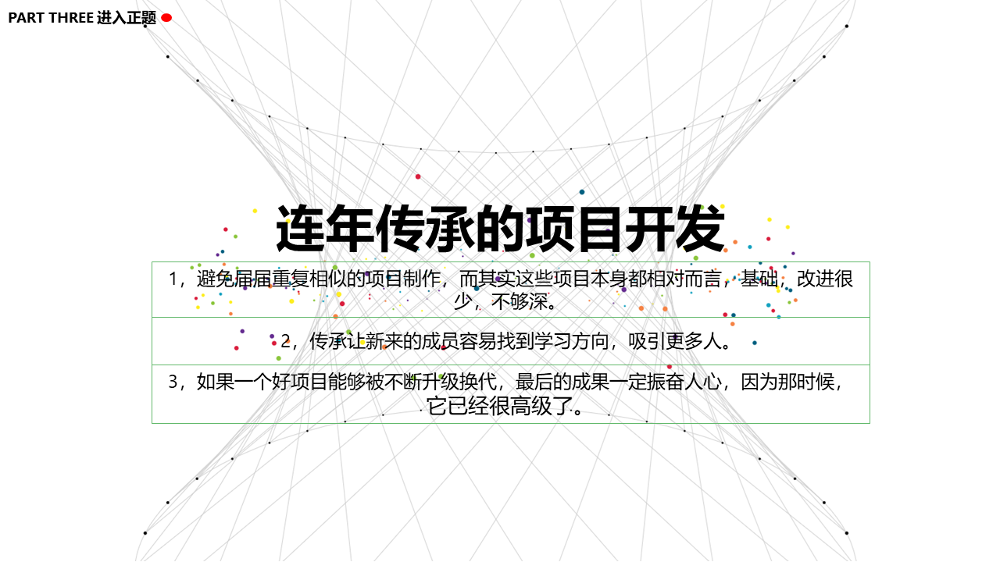

PPT 旁白：

现在如果各位是有想法的可以提出来，大家一块讨论。

说不定会迸溅智慧的火花

解决好问题后，继续进行我的想法的说明。

------

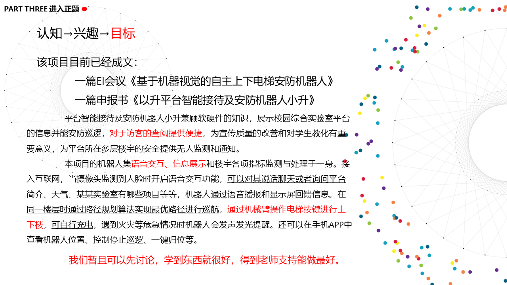

PPT 旁白：

一说到，电梯按键的识别，大家有没有什么主意，怎么去实现？

还有语音交流？

还有人脸识别？

自动切换充电装置如何设计？

学无止境哈。。

------

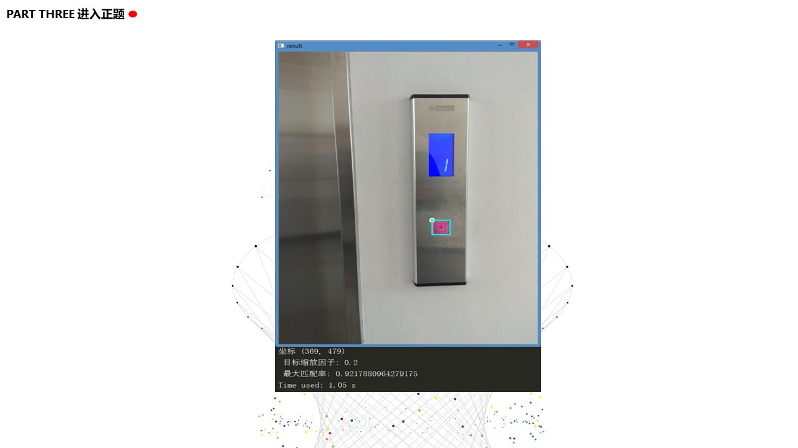

OpenCV（模板匹配） 做的 电梯按钮识别和定位，便于机器人的机械手去操作电梯，而实现自主上下楼。

------

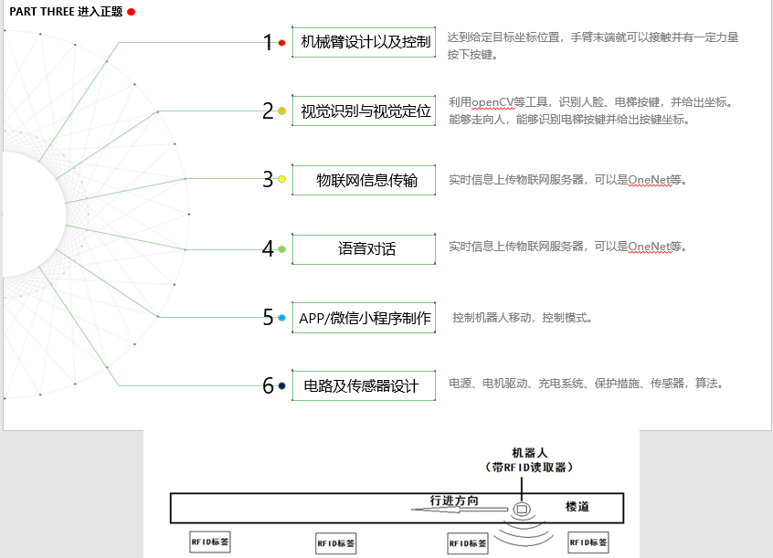

机器人楼道内定位依靠 RFID 技术。

------

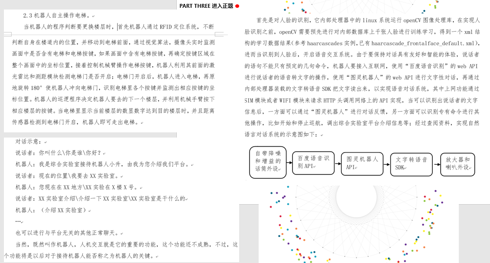

文章内对一些具体技术的描写。

结束。

------

# 某一夜想到那一天...

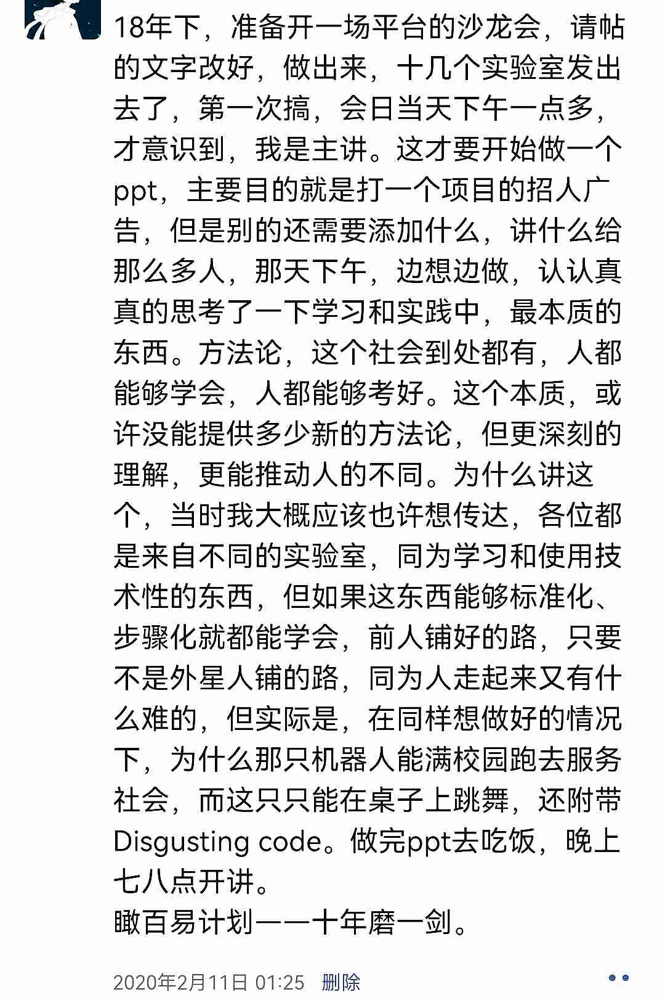
