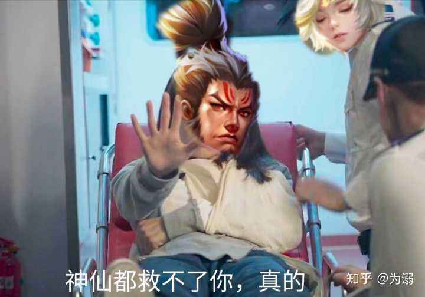
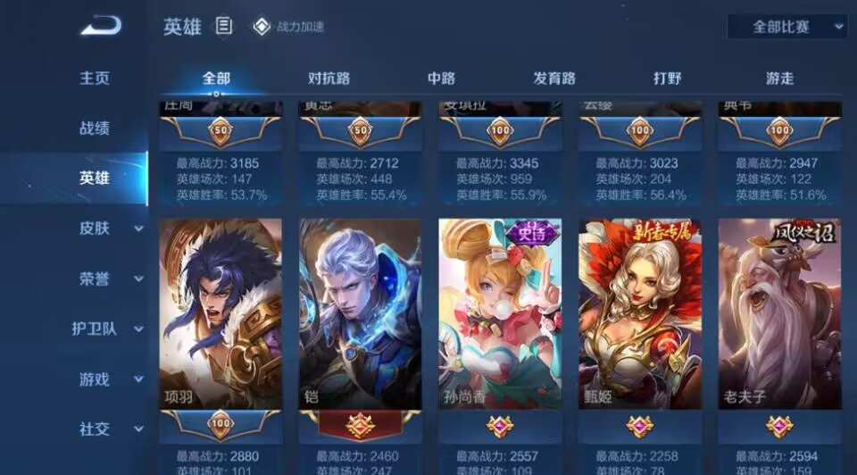

# 王者荣耀的匹配机制和英雄平衡已经崩了

# 王者荣耀的匹配机制和英雄平衡已经崩了

本文分为两个部分：分别是 “涨经验的提醒几句” 和 “王者荣耀的匹配机制和英雄平衡已经崩了”。

首先我总结一些提醒。

## 涨经验的提醒几句

选相克英雄，对面肉就出真伤英雄（貂蝉、吕布），对面百里可以女娲应对，对面有蔡文姬要记得出梦魇，对面控制多就可以考虑庄周解控等等等等。

把我方的输出的经济搞的多多的，把对方输出的经济搞的少少的（压制对方的输出）。尤其是扶持我方射手和多针对对面射手（或者对面哪个势头强就针对哪个）。就是把朋友和对面威胁小的搞的多多的，把敌人和对面威胁大的搞下去。不就这么个理儿嘛。

辅助多扶持射手，能提升赢的概率。把我方射手经济扶持起来，有输出的射手就算只会在后面站着傻射，至少也确保了团队的输出。

开局节奏：辅助跟射手去压制对面射手，法师或打野时不时去发育路支援（如果我们发育路势头很猛但是我方对抗路被压制，就去多支援对抗路，木桶效应，阵容别有太大的短板）。如果对面法师去了对面发育路，我方法师及时发信号，同时也对等的去我方发育路支援。战斗至少要对等的打，以多打少更好，胜率才大，以少打多大部分情况不可取，因此直接尽量避免就是了。发育路射手打掉对面一塔之后，立马去打中路对面一塔，对面中路一塔掉了，我们的各种优势大概率就慢慢起来了。

买装备，根据对面英雄特点随时或预先调整。对面法伤多出法抗，对面物伤强出物抗或反甲，对面有蔡文姬等加血的出梦魇，和对面打的势均力敌出名刀或复活甲（给自己增加逃或反杀的机会），在此基础上尽量出增加自己伤害的装备，或者灵活预判调整。

尽量有控制技能的，或者肉的先冲上去开团，然后输出站好有利位置去补伤害，优势大。总之就尽量只打优势大的团战，少打劣势战，才能胜率大，不就这个理儿。

大家打大龙的时候，辅助去帮看视野和骚扰对面，防止对面过来抢龙，这是这时候辅助的重要职责。辅助不用帮着打龙，辅助的伤害在打龙的时候能起多大作用？对面打龙的时候，看情况，如果我方人都到齐了，如果能抢，就上，主要针对对面大野和射手，我方坦克先冲上去开团，我方法师有控制技能的赶紧上去补，辅助保护我方打野和射手去抢龙；如果我方人还没到齐，就骚扰对面打龙，吸引对面注意让其停止打龙，给我方队友赶来拖时间；如果对面人很多，就别骚扰了；或许我方有能人异士单枪直入抢龙呢，或许直接等着守家清兵吧，对面可能也有意外发生呢。

多找机会清兵线、推塔，多分散对面注意力，别好像没事的时候就布朗运动随机转悠遛弯，你要么是在支援，要么是在清兵带线，要么是探视野，随时注意对面的兵线是否压过来、对面是否偷塔，等等，思路清晰，时刻有个事干，别在峡谷里遛弯似的，搁那布朗运动。

后期，尽量带着兵线去打、带着兵线上，优势大，兵线没到就想着随时撤退。并行清理多路兵线，多路兵线上去会有效干扰和分散对面人员，而我方人员可以集中一路攻上去。

## 王者荣耀的匹配机制和英雄平衡已经崩了

你说我这么多百强英雄，怎么着也是轻轻松松王者段位吧，不，以前是，但现在匹配，让我打个钻石都上不去

已经卸载游戏了。

本来有王者段位的水平和意识，但tmd赢多少局就输多少局，始终上不去分，强行的压制你的胜率在50%（实际上我大部分英雄胜率在55%~60%），等你这局打的好了再开下一局给你匹配4个混子，你没发挥好、打不好的时候再给你匹配系统认为和你水平差不多“一样次”的；几个赛季以前很少遇到双方人头数量差距特别悬殊的情况，差不多都是旗鼓相当的，打得很欢乐，现在这几个赛季，上来几分钟就是动不动一边倒的态势，要么队友哐哐哐一直送个不停，跟丢了脑子似的，要么是对面儿哐哐哐的一直有人送，不像以前还可以经常打的有来有回比较有意思，现在，要么跟打人机一样，要么就被对面压的几乎根本没有反制的可能，没什么意思了，真的。

它这匹配机制现在是有大问题的，很伤体验。对比一下你就能发现，之前我们10个人相互认识的同学开房间开黑，我们的水平都是差不多的，打了两局，打的有来有回，最后一看两边的人头数都一致，但是如果你要是自己打匹配，系统指不定给你各种不公平的匹配，由此来强行控制你的胜率，而不是根据你的真实水平来让你达到相应的段位，这么一对比，这匹配机制是有大问题的。还有，英雄之间的平衡也开始崩了，像是夏洛特、狂铁、孙策，这种又肉、又特别控、还有不小的爆发输出的，就是bug的存在，还有墨子和刘禅，控制别人是不是太容易了，而且输出还很高，我只要看见对面选这些，那么我的胜率很大很大概率会掉，这些都是bug英雄，他们的技能机制相比其他同类英雄来说都是过于明显的不合理的存在（其他英雄要么是有控制但是输出很小之类的，总之都各有短板），这里只是举几个例子，在你想说可能我可能打不好、不会玩之前，你先想想或者再有意观察观察，仔细看看我上面描述的用词。

甚至有时在打的时候我都怀疑我是不是在局内被弱化了、或者加强了，顺风局的时候我的伤害超出我认知的高，我残血还可以反杀三个，莫名其妙，逆风局的时候对面的伤害超出我的认知的高，我们三个满血瞬间1秒左右被对面秒掉了，莫名其妙；伤害、暴击是有一定概率打出来的，是不是系统检测到你们顺风，那么打出暴击的概率就比对面要高？然后这样可以加快结束一局？然后可以让赢的玩家和输的玩家都还想再开一局？比一局玩很长时间更能留住玩家？？

更多讨论：

[(Staok 的想法: 就想让王者官方看看，是不是针对老用户 - 知乎 (zhihu.com)](https://www.zhihu.com/pin/1283385430667317248)

[(王者荣耀的匹配机制公平吗? - 知乎 (zhihu.com)](https://www.zhihu.com/question/355174618)

[(我就想知道现在的王者荣耀匹配机制是怎么样的? - 知乎 (zhihu.com)](https://www.zhihu.com/question/515880829)

[(王者荣耀匹配机制是如何运作的? - 知乎 (zhihu.com)](https://www.zhihu.com/question/468047972)
