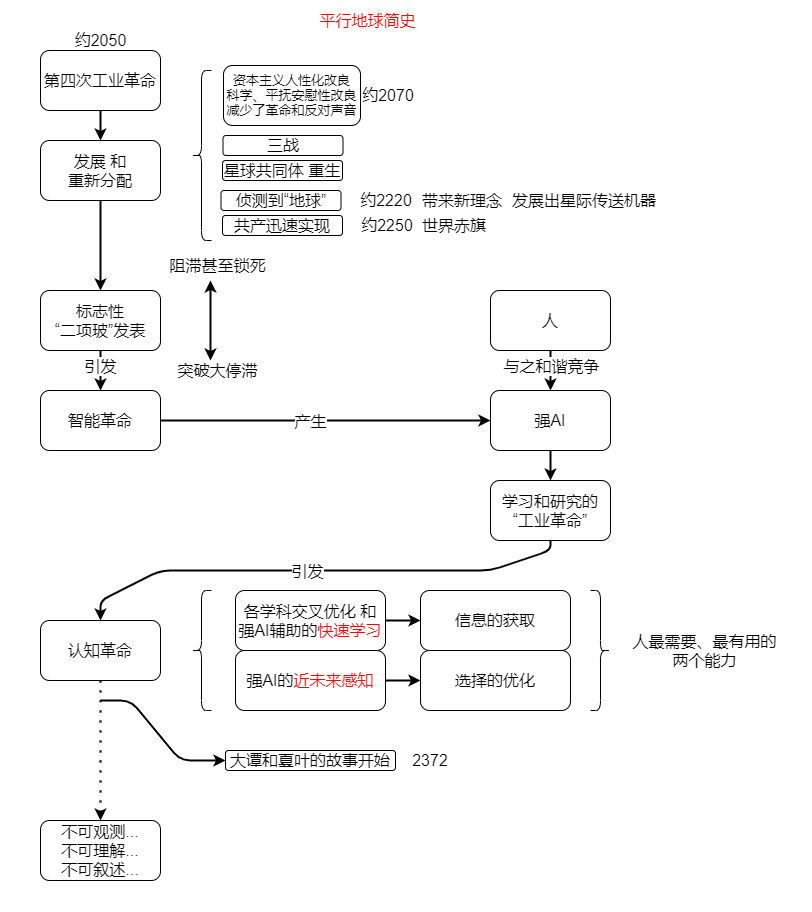

# 科幻小说《请留在未来》注解篇

小说发在 [Github](https://link.zhihu.com/?target=https%3A//github.com/Staok/Please-stay-in-the-future)、[知乎](https://zhuanlan.zhihu.com/p/361265924)、[BiliBili](https://www.bilibili.com/read/cv6305018)。

1、  冰冻三尺，非一蹴而就。既然要写，就写好，计划中，首先设计世界观和大背景，围绕我要表达的思想构思故事内核和主线，再填充对话和动作，最后在写的时候，站在第三视角叙事，站在第二视角交互，站在第一视角思考。

2、  关于文章的标题，在成文期间左右不能确定，可选择的有《未来往事》、《对话》、《灿烂的曙光》、《我和黄昏喝醉之前的故事》和最后想的《请留在未来（中标）》，每一个都有自己的视角和立意，经历这次，深知一千个读者有一千个读法。第一个标题让文章偏向科幻，发生在未来的往事？有点意思，另外也是在致敬《回到未来》；第二个标题重点表明此文包含大量对话，情节都在对话中展开；第三个标题表达一种期许，未来不一定都是灾难与不安，它也很可能是“灿烂的曙光”，文章写的也正是如此；第四个标题偏向两个人的感情，夏叶走之后，大潭看着金色的黄昏发呆，喝醉后打开记录仪开始记录这个黄昏之前所发生的种种事情，让这篇洒洒两万字的文章最后就变成一狗粮？第五个标题最后想出，也是中标的，也是很想表达的一种“正道的光”，就是心要有远景，年轻人，要看得长远，要留在未来！

3、  我的创新观。很多人都说过到底何为创新，怎么做就算创新了，我就说点不一样的，具体的，可操作的，个人愚见。那就是贯穿全文的“二项玻”定则，你可以按照这个定则来想新的事物，比“TRIZ理论”简明，即“组合有意义的组合”和“简化能够之简化”。

4、  “一天晚上，夏叶吃过晚饭，戴上耳机听几首歌，一首流行英文乐，一首中文情歌，再出去压马路转一转，到公园稍微活动一下，同时还听着一首摇滚，一首民谣，一首说唱，一首future bass风格的电音，一首Vocaloid，一首日系轻音乐和一首交响乐，回到家，刷了几下朋友圈，聊一聊，对明天的日程做一个规划，查一下长期任务的完成情况，再洗漱完毕，便关灯睡去”，这一段明显罗列了好多种音乐，暗示之后出现的大潭的好友华和洁的多元身份“搞科研和私家侦探”，以及玻柏的“认知学家、计算机学者和DJ”，即有更多的“斜杠青年”，文中也有对这一现象的描述“现在又好像一千年前达芬奇时代那样，一些人掌握学科的门类相当广泛”，这也是因为文章的大背景，AI辅助学习和认知，几乎绝大部分知识的学习没有了壁垒，教育不均甚至学校教育都将消失，知识能力不再是造成人之间鸿沟的主要原因，在这种状况下自然推演，科研变成了文中所描述的“才艺”，一人能够感兴趣和深耕的领域变得多元。

5、  文中开头夏叶读的书，关于“圆周率包含了所有可能的数字排列”这一论点是本科幻小说的假设，因为目前尚未证明。

6、  文中的“精句”，已作标出。

7、  文中的注释符号如“①”等，均出自一本叫《平行地球漫游指南》的书，它描述了关于在平行地球漫游你想知道的一切，你买不到因为这本书只在平行地球发售。这个设置是致敬《银河系漫游指南》中的《指南》，其背后因写着大大的“Don't panic！”而非常畅销，本文多处出现的“42”也在致敬于此。

8、  对于大潭弄来42克钯元素过程的详细描述，在真实世界也可能发生。

9、  “电脑AI温馨的提醒着“一会要有光，小心眩光”，在机器的容器内渐渐有了光”，这里是在模仿“上帝说，要有光，于是，就有了光”，有从无到有的意味，但是万物的原理还是要相信科学，一个高科技的高阶AI智慧说出这种话，也在反讽过度解读圣经的愚昧吧。

10、     “天呐，我是在科幻小说里吗？”夏叶惊呼。“不，因为这里没有宇宙飞船、全息投影和机器人！呃…科幻作品里面不都得有宇宙飞船、全息投影和机器人这‘老三样’吗”，这一段啊，这一段是在一个科幻作品里把其他科幻作品的套路揭底，本文虽然描述未来世界，但确实没有出现这三样。还有后面的大潭对夏叶解构科幻作品，同理。

11、     文中仿写了一段SCP故事，是一个永远也不会让人通过的面试官。这篇文章中某些内容写的很早，SCP这一段就是2019年面试被拒后写的，在这之前所有人都说我的能力足够通过那个面试，当时真的真的很难。

12、     文中“施教授与一位国外科学家聊天”这一片段的前两段出自施一公演讲，第三段为本文增加的后续对话。

13、     “国外的杂志《竹叶刀》”，对标真实世界的《柳叶刀》。

14、     “有的人讲人机共处的社会没有民主和自由”，“研发出了一种化学试剂，当作疫苗一样注射，可以消除人们的种族主义心理”，“他们强烈反对与AI人共同生活的人机共处，却用着AI发明的科技悠哉生活”，结合魔幻现实，你细品。

15、     文章最后以AI为主要视角续想第四次工业革命之后的两次科技革命的形态，一般来说，第四次工业革命的突破口在哪里，是什么形态都很难想象，更不要说其后的两次科技革命是什么样子，但想象嘛，可以讲出来。内容不一定准确，但提出一个观点，不论科技再怎么先进，人认知的方式和深度决定着发展的上限，如果这个上限突破了，科技发展等就像文中描述的一样潜力无穷了。就控制科学的角度说，控制算法再先进也是无限逼近被控对象的能力上限，想办法改进被控对象自身才会提升这个上限。

16、     文章故事发生在第六次科技革命伊始，夏叶走后，大潭进入休眠等待夏叶回来。但是（转折），文章注释⑧中说，由于那时的科技进步飞快，就是上面所说的“上限”被突破，使得历史进程急速加快，平行地球随即进入隐匿状态，外人无法观测、无法理解和无法叙述，也即是说，大潭和他所在的平行地球“消失”了，夏叶应该永远回不来了，对于他们二人，这真是个悲伤的故事。

2021.1更新

17、     我后来注意到，关于核聚变实现后现实世界的改变的一些想象在《三体2》中有竟大部分雷同，以及x米公司实现了与大刘描述的很像的初步的“隔空充电”；我得在这澄清一下，在行文期间我还没读到《三体2》；我一贯主张行走在想新的事物这条路上，平时连重复的“梗”都很少玩（但是一玩大家就欢快起来，就像触发器一样）；与大刘在“核聚变实现后的世界”这方面的想象有所重合我又惊又喜。

 2021.9 更新

18、正文大幅修改，为投稿补充更多细节内容，修正一些Bugs使文章更合理，将结局修改为开放结局版本。版本为 v1.0。

19、半补全结局，版本为 v2.0。

20、平行地球简史攻略图

 

“别担心，我们地球的光会到达遥远的星系，在每个太阳系中，我们都重生，所以我们会永远在一起。”————格卢什科夫

