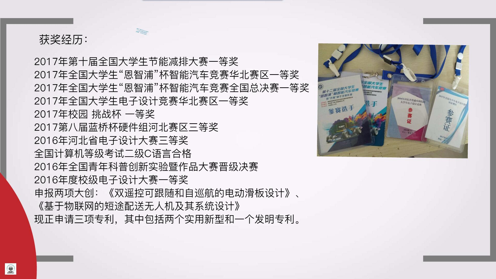
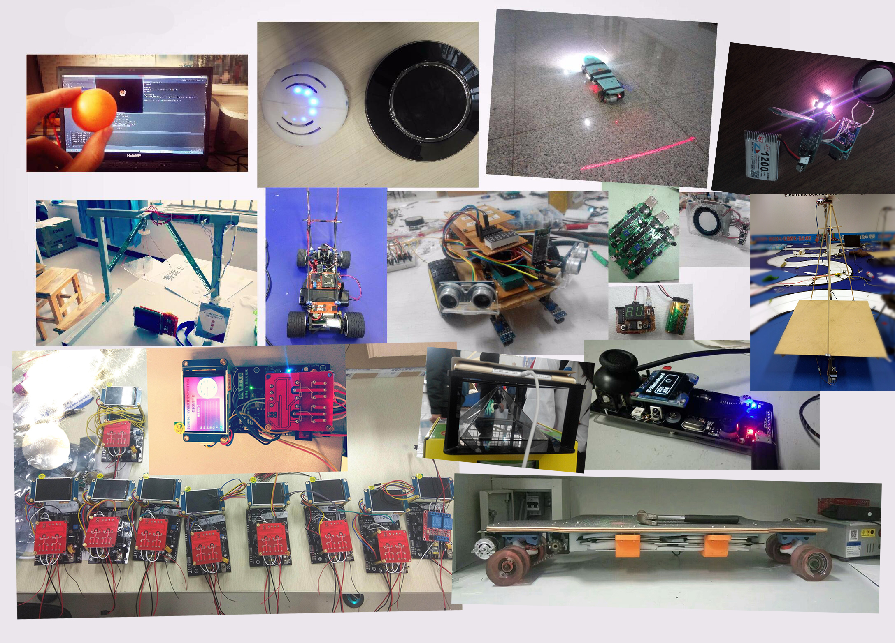
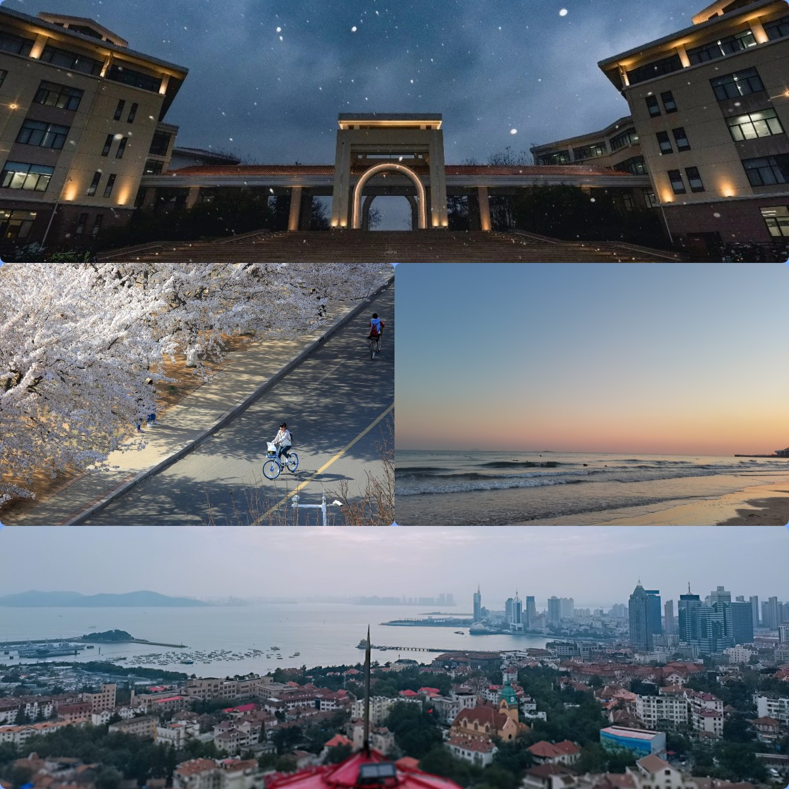

# 【杂谈】过往时期2-嵌入式求学故事线简忆

## 过往时期2-嵌入式求学故事线简忆

前一篇文章 [过往时期 - 欢迎来到 Staok - 瞰百易 (github.io)](https://staok.github.io/7过往时期/)。

------

在我兴趣广泛的过去，关于嵌入式方面的经历啊，讲一条这个的故事线。

小学，电子积木，灯泡，电机，上电发光、风扇旋转，风扇转的快了还会飞到空中转，好玩，但更多的是感觉神奇！

初中高中，参考电子积木上进阶电路，父亲偶的一次带领我到一个本地的电子零件店，买了电烙铁焊锡松香，还有一些电子零件，自己做了三极管和阻容感结合的频闪、蜂鸣器等电路，可以用电位器调节震荡频率。小初高同样的，也拆过很多东西，机械的、电子的，看看瞧瞧里面啥样，它为啥能运转，好玩。

那个时候对电路和元器件只有一些朴素的感性认知。

直到大学，带着这些感性认识，也就是说带着期待、兴趣和问题，去学、去理解自动控制、数模电，算是对这些电路有了理性认识，能够计算和模块化设计了，但仍然是不成系统的，只是一些不怎么连贯的知识单元、碎片。

本科的经历，具体来说：

在高中毕业的那个暑假，接触了51单片机，淘宝了一个开发板，五十几块钱，那几个小时的配套视频教程，连带C语言和单片机编程都讲了，很感谢那是我的启蒙教程，以前玩电路，搭好了就不能变了，现在，任意IO口的高低电平，我可以通过程序控制、自定义，这种灵活性、高度可玩性的特点，一次次对我小小心灵予以震撼和开阔视野。

大一进了校内的电子科技协会，和一众四处聚来的志同道合小伙伴，在群里拉呱，后来统一被安排去一个屋子里，在那里学习，简陋朴素，但每天相互见面有说有笑，互相学习、互相交流。后参加校电赛，我组三个人的作品第一名，进入实验室，大二备战智能车竞赛和电赛，和基本同样的那一群十几个小伙伴，在实验室住了半年，因为那个实验室传统就是这样。

大三大四的也都还常在实验室，自然的传帮带，自然的搞技术的氛围，都是感觉很自然而然，而且备战比赛、学习嵌入式很方便。技术上，前辈好多届磨练出的软硬件，可学性、可用性很高，至少对当时的我来说，又是一次次对我小小心灵的震撼和开阔视野，包括IMU、编码器、摄像头、屏幕、用结构体、指针等实现的菜单库等等的软件，H桥、运放信号调理、电源等等硬件，在那时候有了很丰富的认识。

当了两个实验室（校级的电子科技实验室和创客空间）的管理层，这里本科时候故事好多，多的也不在这里提了。

在这个实验室基本上考研上岸率很高（每一届基本上只有很少本科毕业去工作的，大部分都上研究生了），并且工作基本都不错，相当于 一个双非学校里面一小群“985”质量的学生，甚至可能高于“985”学生的平均质量（有点自夸嘿嘿）。

技术上的学习和实物设计基本合理，积累也丰富，做东西去比赛大概率就能成，智能车国一，节能减排国一，电赛省一（当时个人模电还不算好，复赛综合测评没过，差一点进入国赛）。

上图是本科阶段做过的一部分东西的合订本图，包括智能车国赛的、国电赛的、节能减排国赛的，以及一些自己做着玩的学习新东西的。

------

进入研究生，还没入学，意识让我定下一些大的小的目标，写在一张纸上一直存着，时不时看一看，主要是：

1、对本科接触到的软硬件进行一个综合性的再学习和分门别类的梳理。这其中学习部分包括正点原子上千页的手册的STM32的几乎所有外设、软件组件；还有对自动控制、数模电的再学习，这次是联系实际的学，从我的相关网络发表的技术文可瞥见一二 [【直达本质入门】系列](https://staok.github.io/categories/直达本质入门系列/)，而不是课堂那样抽象的涂鸦；还有一直想学并且实验室需要的FPGA，主要是Verilog和SOPC（这是对计算机组成原理的真实体验）。这是打基础，对嵌入式有个上下层贯通的认识，从沙子到CPU再到汇编和C，梳理就是总结经验、软硬件模块和软硬件设计规范，从我的相关网络发表的技术文可瞥见一二 [【规范】系列](https://staok.github.io/categories/规范系列/)，具体太多，这里不展开。

说到基础，那么一些经典，学习一下：计算机组成原理，计算机操作系统，深入理解计算机系统，计算机网络。初步的时候，理解这些东西的结构，有个印象，之后理解越深越好，这东西学了也不容易变。

2、学Linux，这块硬骨头在我硕士期间一定啃下。学习的步步前进的总结可见 [【主线剧情】Linux 系列](https://staok.github.io/categories/主线剧情linux-系列/)。

在硕士实验室自主学到了很多。

在硕士的生涯丰富，各种意义上。

谨以我的毕业论文的 扉页 和 致谢的开头部分：

------

说这么多，我觉得，其实就是巨大的兴趣驱动力。做成一件事后的成就感、满意感颇丰。

- 找对教程（开发板、教程手册和视频。注重综合性和系统性，即横向开阔认识，纵向刨根问底）。
- 勤于实践（学习例子验证，自己有点想法实施试试，做东西，搞出来，好似在施展魔法，麻瓜的魔法是科技）。
- 及时总结（实践、调试经验的成篇章的文字总结，软硬件模块化总结、归档，方便以后，并且越积累越多）。

这里，[可见我总结的一个 硕士实验室嵌入式学习路线参考清单](https://staok.github.io/%E7%A1%95%E5%A3%AB%E5%AE%9E%E9%AA%8C%E5%AE%A4%E5%B5%8C%E5%85%A5%E5%BC%8F%E5%AD%A6%E4%B9%A0%E8%B7%AF%E7%BA%BF%E5%8F%82%E8%80%83%E6%B8%85%E5%8D%95/)。

------

投了、面试了哪些公司（不分先后）：大疆、华为、蔚来、理想、荣耀、字节、英伟达、英特尔、恩智浦、算能、科大讯飞、美团、京东、小米、乐鑫、360、虹软、地平线、芯驰、嘉楠，等等。

还有这种合订本 [23届春招内推全汇总_互联网-科技-国央企-游戏-快消-金融 (qq.com)](https://docs.qq.com/sheet/DQ3haZXRvcUNTTlVY?groupUin=S2cndn5KtnURS0v8Qskjvw%3D%3D&ADUIN=1134763854&ADSESSION=1677496880&ADTAG=CLIENT.QQ.5959_.0&ADPUBNO=27288&jumpuin=1134763854&tab=BB08J2&u=e621fff441474f46ba59967ff91d1124)。多找一找，总有很多很好的网友的总结。

面试准备

1、基本：先介绍自己，姓名、学校、啥时候毕业，自己会什么，再概括性的介绍自己硕士期间的项目，说两个最具代表自己的。然后面试官大概率都围绕项目里的技术细节问，这是我刚才说的横向和纵向深度的理解自己做的东西，横向认识的东西多、相关机制基本都知道（比如进程间通讯和线程间同步能不能全面且准确讲到位），纵向认识要知其所以然，而不只是表面用用。

2、面试前的笔试，以及面试时候现场编程：

笔试看一看搜一搜 牛客、CSDN、Github 等上面相关的。

提前学一些数据结构与算法，然后力扣刷一些代表性的题，可以 B站 搜 热门题、大厂高频题等等，包括牛客上看一看面经，github上面也有一些面经和学习总结和笔试题总结等的好的仓库 [（大集合）数据结构与算法简述和CS综合 - 欢迎来到 Staok - 瞰百易 (github.io)](https://staok.github.io/15数据结构与算法简述和cs综合/#附cs-综合学习类)。

比如：这里只是举例，多找找适合自己的、看得进去的。

- [代码随想录 (programmercarl.com)](https://programmercarl.com/)。
- [华为算法大佬耗时200小时录制：Leetcode刷题100道，足以吊打字节面试官！_哔哩哔哩_bilibili](https://www.bilibili.com/video/BV1eg411w7gn/)。
- [LeetCode 最热门 100 题_哔哩哔哩_bilibili](https://www.bilibili.com/video/BV1Pq4y1j78o/)。
- [复习100分钟拿下100分，你能做得到吗？【C++】(面向对象程序设计)（总复习）_哔哩哔哩_bilibili](https://www.bilibili.com/video/BV1ta411k7Yn/)。

基本的：栈（FILO）、队列(FIFO)、链表（单\双）、树（线索\排序\平衡\红黑）、图（DFS\BFS），常见的排序算法，双指针思想（快慢双指针、相向移动双指针），哈希表的运用，串搜索（暴力法和KMP法），五大常见算法思想：动态规划、分治、贪心、回溯、分支限界。

------

最近的这几年，除了上面研究生订的计划，还有一个一些要学的东西的计划 [StaokGo的动态 - 哔哩哔哩 (bilibili.com)](https://www.bilibili.com/opus/361454135418331345)（始于2020），这个现在基本还算中。然后是一个“瞰百易”计划，十年磨一剑，源于考研期间的一个晚上有感而想的，具体是实现一些可变现的东西，只一些想法，但是还不确定能不能成，说是十年，已经过去4年（始于2019）。

选择。进体制、进国企，一个师兄说，这是一种假稳定，我借用他的评价。另外可看一看这个 [【张雪峰】计算机好还是体制内好？穷和累你更受不了哪个？_哔哩哔哩_bilibili](https://www.bilibili.com/video/BV1dL411q77C/)，说的在理。我可能注重效率，一年挣的能赶上五年挣的，我加把劲几年，挣到了，更自由，感性上或者说心理上那时候能接受的东西可能也更多了，我需要的是，我还有选择。[如何看待周鸿祎称「打工是用老板的钱给自己交学费，在公司混日子是浪费生命」？ - 知乎 (zhihu.com)](https://www.zhihu.com/question/465936066/answer/1950602532)，[【杂谈】给本科实验室的分享PPT-21.7.23 - 欢迎来到 Staok - 瞰百易 (github.io)](https://staok.github.io/8给本科实验室的分享ppt/)。
