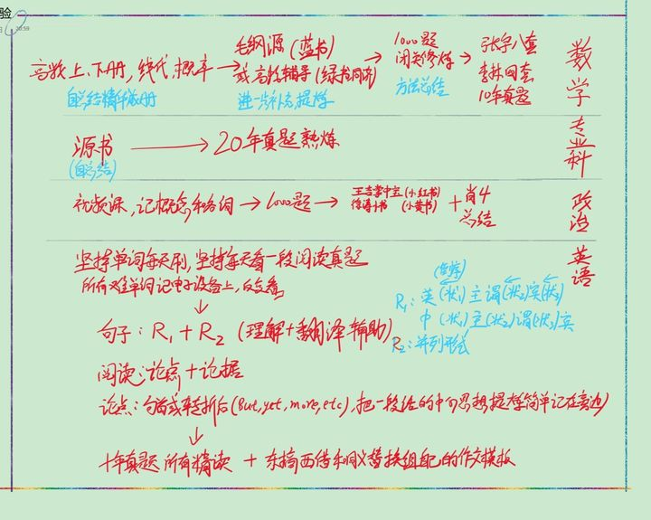
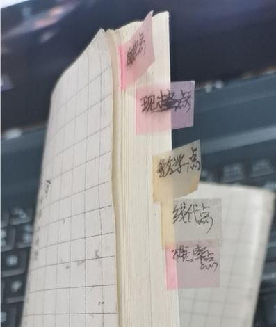

# 【考研】噫嘘唏，考研个人经验汇总

纯干货，不上升到哲学，提个醒，实际安排可调整。

安静，是好环境。

我默认你心理素质强大，所以下面不讲心态的事情。

------

## 选学校

即给多个意向学校的难度做个排列。

首先搜索意向专业的全国高校排名（即搜XX专业大学排名），然后在专业排名名单里逐个查看以下四个内容，形成难易程度可以对比的一个自己的名单。

难度主要看：

1. 对于学校的初试专业课自己是否熟练或者能够熟练；
2. 往年复试分数线；
3. 往年报录比（最好是报的人可以，而且录的人还挺多），看专业统考招生人数和录取名单，以及录取名单上面有多少人和其分数；
4. 复试科目（笔试+面试，初试以前不很重要）。

最后在名单中的前三个，看城市、学校综合排名、牌子等要素确定一个学校。

## 备考

1. 专业课往年真题（要烂熟于心）。
2. 英语：先背单词，往年20年真题中所有不会的单词尽量全背，我使用“文本处理工具Replace Pioneer”把20年真题全文粘到这个软件里面，然后给所有单词按照出现次数排序（没错，word 没有这个功能），这样列出所有真题的不重复的单词列表，然后过一遍，着重所有一开始不认识的生词；因为我是稍微有点语感的，所以只要单词认识然后长难句顺口翻译，所以先全背一遍单词；做真题的阅读，读多了慢慢就快了，先看问题，然后去文章中找答案；作文，就准备自己独特的模板，从多个模板各摘一点；
3. 数学：过1、2遍所有课本（数一：高数上下册、线代和概率论），认真总结所有知识到笔记本，要有框架的概念，日后查和背很好用；过1、2遍名家全知识点解析书（毛纲源的（推）、张宇的或者课本配套的解析书（同济绿皮的）等）；烂熟地做真题（近20年）；多关注张宇和李林的微博，不但有测试题，临考还有画重点，准确性值得去会；不要只看重点，全面的看；最后认真做李林（推）、张宇等的预测卷；
4.  政治：看网课（徐涛的），有个印象；过1遍知识解析书（徐涛的或肖秀荣的）；最后必背肖八、肖四（推，感觉太多就只背肖四）；并多关注徐和肖的微博或者公众号，不但有每日测试，临近考试还有画重点，如果肖画了肖四的重点题，那么就只背重点题，其他不管，成功写上也就有60分左右了；背的技巧：编短语，比如最后画了重点题，这几个题可以归纳出八个大段的话需要背，每一段摘一个字或者两个字，然后组合编成8个字或者16个字的类似“顺口类”的短语，做到把其中的字对应一大段话，做到只要一说这个短语就能全部说出来，就都能记。

下面是一张“泛泛经验”的图。

 如下图，这是把大概五本书的内容总结成一个小册子。

精简，找到规律，形成框图和节点的连接关系，也好理解也好记，每天看一些，记一点，慢慢就看完了。

## 复试

1. 复试是竞争，要先回想和归纳一下本科所有有价值的经历（认真的，不开玩笑），列出来，并形成一个简历（成就罗列）。
2. 复试看能力，除了学业就是相关领域的竞赛奖项、经手的项目、论文等，还有毕设的完成情况和含金量，这些要尽量主动多说，问一句要回答的多而全，言之有物，尽量表达自己的亮点（经历的难点或与众不同的点）。
3. 如果相关竞赛等成就囊中羞涩，老师会多问学业、专业课上的细节问题，不但书本上大部分概念要记全面而清楚（尽力），还要有一个总体认知（总体认识也便于对一个学科记忆和应用）。

------

即便是人生困难时期，到坎上了，也会默默持续去做，让自己忙起来，就像独自一人穿过森林（日后虽然不想回忆，但也是人生组成部分）。

耐下性子，多想一想做一做，然后过去就好了。

希望我们稍后在森林另一头见到。
