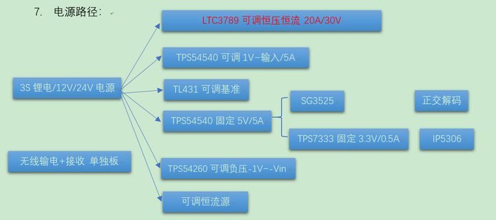
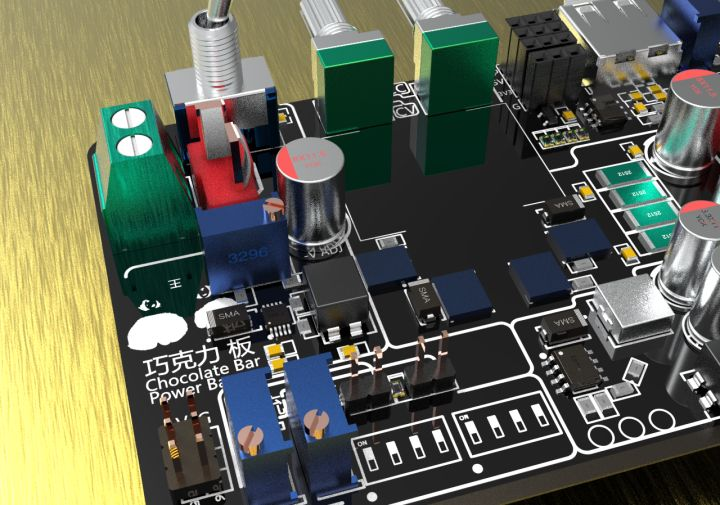
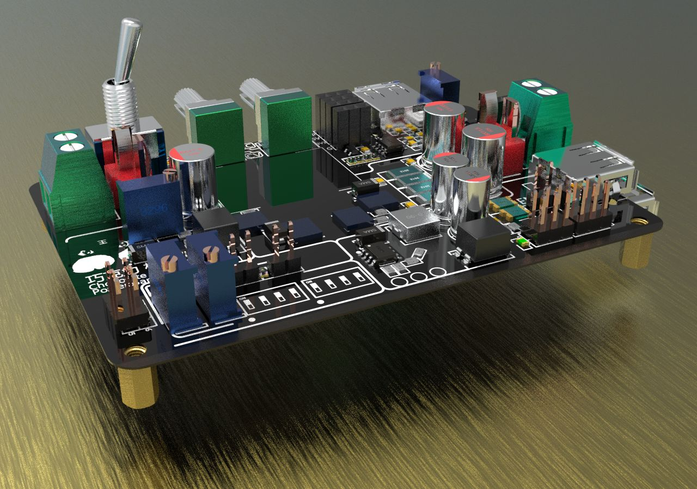
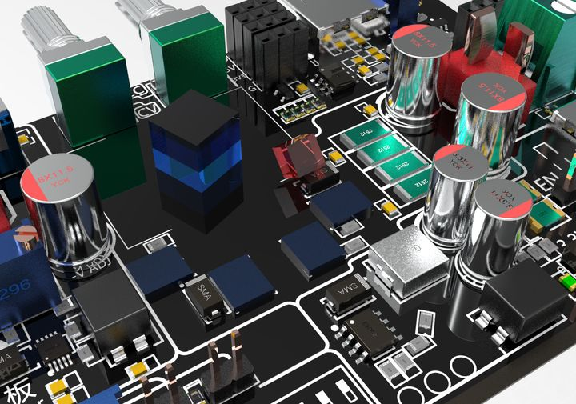

# 【开源电源】巧克力板

一个实现大功率可调的开关电源，附带多路多种输出和实用功能；本项目是“瞰百易”计划的一部分。

## 本项目的 GitHub仓库

[Staok/PowerBar: 一个实现大功率可调的开关电源，附带多路多种输出和实用功能 (github.com)](https://github.com/Staok/PowerBar).

该项目早在2020.7开始在github上更新了，中间停隔了半年多，又于近日开始完成了 V2 版。

## 开源内容

- 设计规划文件；
- 原理图pdf文件；
- 被选型的芯片包；
- multisim 模拟文件，包含CC-CV、恒流源、基准和过压保护；
- 渲染效果图原图。

## 输入规格

- 3S航模锂电池直接供电，或者12V\24V开关电源模块供电。

## 主输出规格

- 主输出：DCDC升降压BUCK，外置MOS，至少10A，20A以上最好，最大可以30V左右(由电阻限制)，恒流、恒压分别可调。
- 主输出可借鉴的芯片列表：LTC3789（外置MOS）；CSD18540Q5B（100V 70A），贴片的占地小。

## 副输出规格

- 固定5V（5A BUCK）;
- 3.3V（0.5A LDO）;
- 一路5A BUCK可调等；
- 可调负电压；
- TL431+三极管做的一路可调恒流源。

## 其他模块

- SG3525提供一组带死区的互补输出的高性能的PWM输出；
- 提供一路硬件正交波形解码；
- 提供一组 XKT412 方案无线输电；
- 提供一组 IP5306 方案的备份电源；
- 提供一组 TL431 方案的可调基准源。

## 其他要求

- 原理图和PCB尽量遵循 [SCH & PCB 设计规范](https://zhuanlan.zhihu.com/p/356679916) ；
- 滤波、地划分隔离、保护措施等尽量遵循 [Staok/protection-circuits](https://link.zhihu.com/?target=https%3A//github.com/Staok/protection-circuits)；
- 输出接口丰富多样；
- 等等。

## 电源路径

## 渲染效果图

