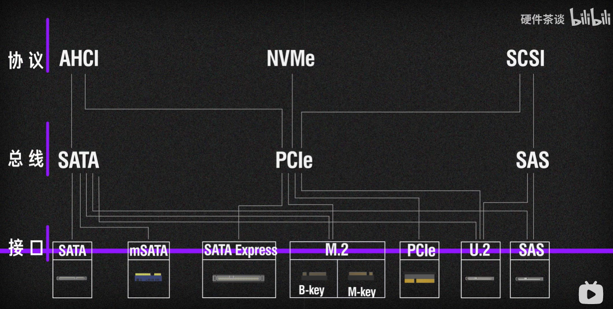
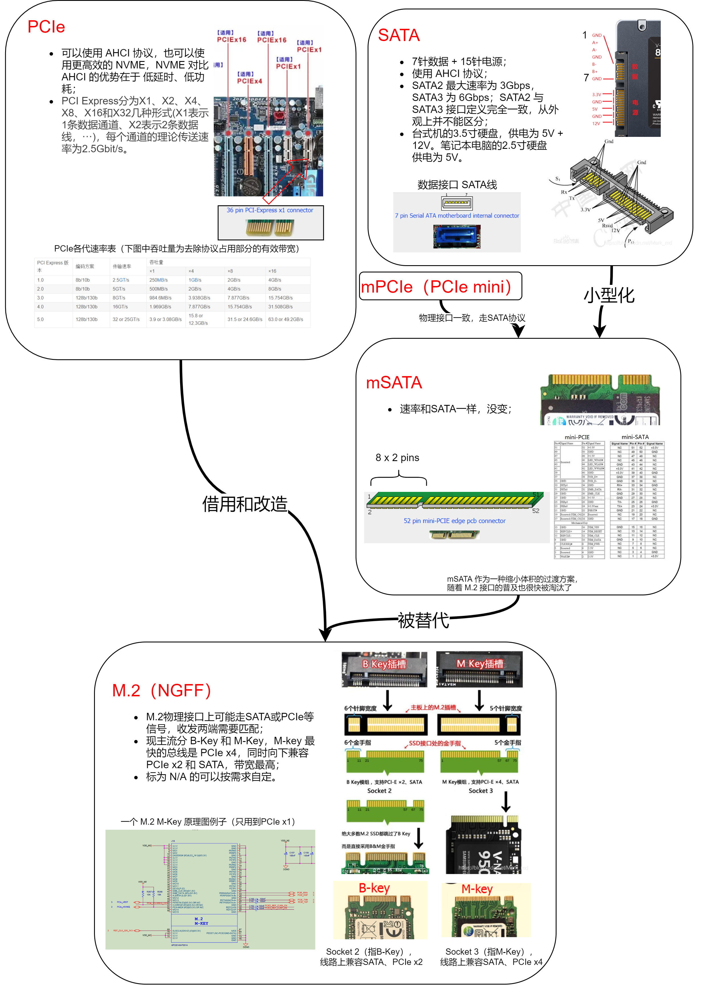

# PCIe接口及其衍生接口大总结

注，相关的介绍网上有很多，这里是一个总结文（用时再查），不是科普文。

参考：

- 搜索标准接口定义的网站：[https://pinouts.ru/](https://link.zhihu.com/?target=https%3A//pinouts.ru/)。
- 一个视频讲的很精彩[【硬件科普】硬盘的SATA M.2 NGFF NVME是什么意思，详解硬盘的总线协议与接口_哔哩哔哩_bilibili](https://link.zhihu.com/?target=https%3A//www.bilibili.com/video/BV1Qv411t7ZL)，推荐从13：13看起。
- [SATA M.2 NGFF PCIE AHCI NVME SSD固态硬盘的接口、总线和协议区分_Mark_md的博客-CSDN博客](https://link.zhihu.com/?target=https%3A//blog.csdn.net/Mark_md/article/details/111149261)。

------

开局一张鸟瞰图（水印表示[出处](https://link.zhihu.com/?target=https%3A//www.bilibili.com/video/BV1Qv411t7ZL)）

PCIe 引脚定义 [PCI Express 1x, 4x, 8x, 16x bus pinout diagram @ pinouts.ru](https://link.zhihu.com/?target=https%3A//pinouts.ru/Slots/pci_express_pinout.shtml)。

SATA 引脚定义 [SATA pinout diagram @ pinoutguide.com](https://link.zhihu.com/?target=https%3A//pinoutguide.com/HD/serialATA_pinout.shtml)。

mSATA 引脚定义 [Mini-SATA (mSATA) connector pinout diagram @ pinoutguide.com](https://link.zhihu.com/?target=https%3A//pinoutguide.com/HD/Mini-SATA_mSATA_connector_pinout.shtml)。

M.2（NGFF）引脚定义 [M.2 (NGFF) connector pinout diagram @ pinoutguide.com](https://link.zhihu.com/?target=https%3A//pinoutguide.com/HD/M.2_NGFF_connector_pinout.shtml)。

传统艺能，一言（图）以蔽之。

别看此文字少，这一张图我做了半天，可以点击查看原图（2.9MB）看清细节。引用材料均非商业用途，侵删。

