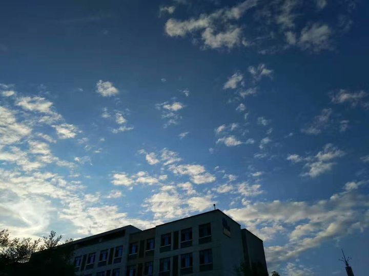
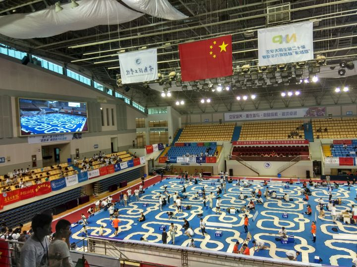
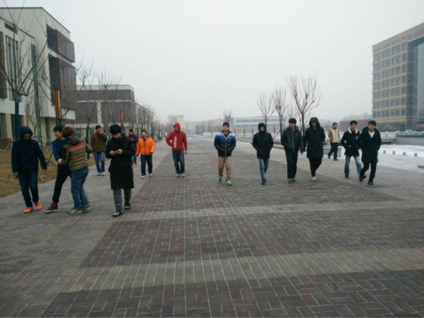
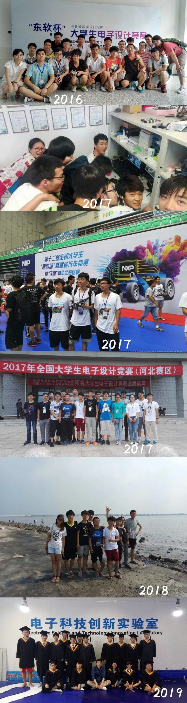
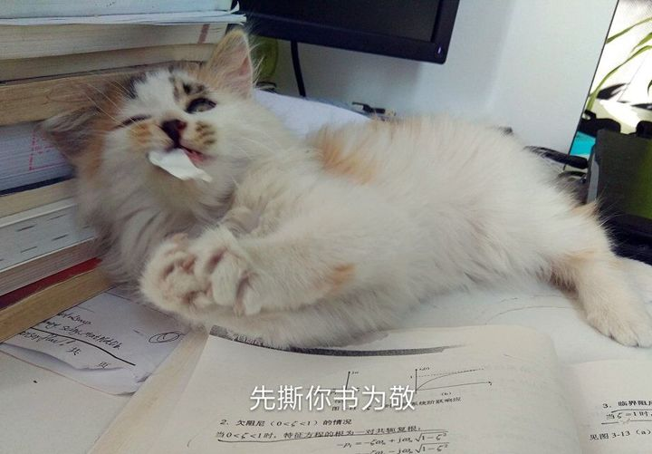
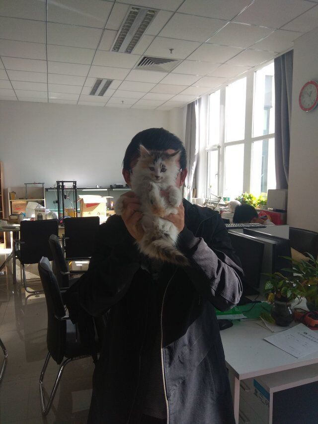
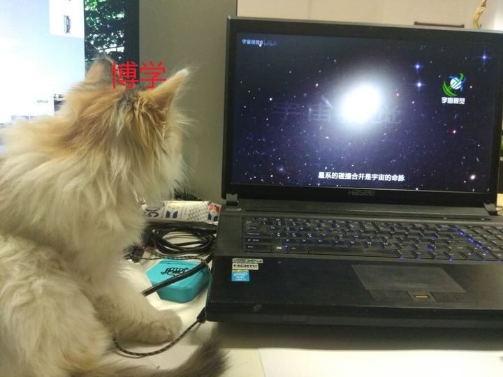
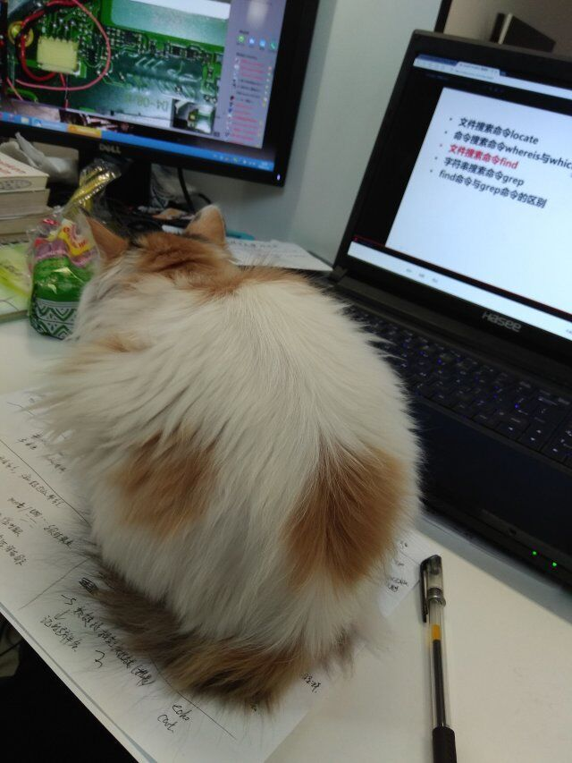

# 【杂谈】过往时期

我发现了一篇本科时候的在2017.6写的《自动化导论》作业，那时还比较懵懂，觉得写的有几分意思，撷取几段，再补一点旁白。最后再加上一个本科毕业临走的时候“写给学校的几个小建议”。

------

《自动化导论——浅谈自动化专业的学习、实践以及行业应用》

> 自从转入自动化专业以后，接触一些电路和自动控制方面的知识，使我揭开电气控制神秘的面纱，亲身体会控制电路和机器带来的乐趣和满足感，希望我能把这个专业学好并且越走越远，这和我以前的经历有关。转入自动化并非他人意志而是我自己决定。我还在初中的时候就对电路表现出了浓厚的兴趣，我爸爸也很支持，便给我买了电烙铁、一些电子元件和一些简单的入门书籍，开始我就尝试搭一些简单的电路，比如用三极管和电容搭的闪光灯电路，还有一些可以调节频率的发声电路等等，那时候用的都是分立元件，而且做完也不是太懂，从现在看来，那时候做的工作都是一些初级的探索，到了高中由于学业问题，不得不把我的爱好放手一下，在高三毕业的那个暑假，了解到我的一个同班同学在学51单片机，并且他说家里人要求他报自动化专业，我便追问了一些问题，从淘宝上入手了一个单片机开发版开始学习，把单片机的硬件和编程语言一块就学了，后来我才意识到我已经开始使用芯片了，而且相比较前面固定模式的分立元件电路，单片机可以由写程序改变功能，这强大的自由灵活给我开启了新世界。
>
> 从大一开始便加入了电子科技创新实验室和创客空间实验室，参加了校级电子设计大赛获得了一等奖，后面又参加了更多的比赛，现在在准备飞思卡尔恩智浦杯智能车比赛和全国大学生电子设计大赛，加入了创新平台的机器人实验室。实验室老师不断强调的是控制算法，我通过不断上网查阅资料和学长的耳闻目染，大概对自动化才开始有了一个初步的认识。这一切的见识应该和自身努力离不开，和我并肩作战的实验室的十几个队友们也是如此。
>
> 在自动化导论课上，我听见了两个熟悉的名词，卡尔曼滤波和倒立摆，应该是实验室的学习和学业和比赛等事情让我没有对这两个东西进行深度的探索，而且四旋翼飞行器也是自动化方面的研究，四旋翼飞行器在实验室有人做过，但是很遗憾我也没开始接触，赶上现在学业紧比赛多，这些研究应该都要放到大三了。
>
> 首先值得一提的是，自动化专业是和实际应用联系非常强的一门专业，而且一个不受控的机器加入自动化理论会自己调节不需要人为控制是一件非常有意思的事情，在实验室的人感受到了但是大部分人只能通过课堂和课本，感受不深。自动化专业是一门应用场合非常多知识需求门类杂的专业，兴趣的引导缺乏和教育深度的浅显，所以接触起来让很多人一开始摸不着头脑。
> .......

------

本科一些图片。

------

旁白 1：在大三结束之前，我参加的不少竞赛，获奖有国一（俩）、国二、省一、省二、省三和校一等，巧的是，正好填补了每一个“段位”。

旁白 2：“人的正确思想是从那里来的？是从天上掉下来的吗？不是。是自己头脑里固有的吗？不是。人的正确思想，只能从社会实践中来，只能从社会的生产斗争，阶级斗争和科学实验这三项实践中来。...无数客观外界的表象，通过人们的眼耳鼻舌身这五个官能反映到自己的头脑中来，开始是感性认识。这种感性认识的材料积累多了，就会产生一个飞跃，变成了理性认识，这就是思想。”——《人的正确思想是从那里来的？》。人的正确思想是从社会实践中来的，实践的重要性在于其是正确思想的来源和验证，但是，让人们投入实践中去，实事求是的来做，很重要的一点是，要有趣，这是行之有效的路线之一，我觉得这个道理很简单但也很难达到，兴趣会指引人们自发的走向实践并求索认知这个世界，所以兴趣是如何产生的，我久前观察过，一个办法是让人们知道意义，讲好意义、传达意义，并且这个意义生动活泼，切中到个人自身，兴趣也许会出现。而做不好表述意义，事情就会变得枯燥，就如同一些人面对专业课的课堂的那种枯燥、无味、乃至厌倦、好感尽失。

------

本科毕业临走的时候“写给学校的几个小建议”：

> 1、做实验太过流程化，检验也太简单使学生很容易应付，学生很少真正从实验课学到东西。
> 2、指导员不关注学生学习和课外实践，只关注纪律卫生等相对不重要的，导致学生很不主动，应当从所有教职工上，多鼓励学生多实践搞探究。
> 3、创业方面，学生做服务型的很多，科技类型的创业很少，有科技类型的也存在复制照搬、过于简单等问题，就是要求水准我觉得应该提高一下，应当多鼓励科技研究。
> 4、每年有几千份大创项目，我觉得问题有两个，一是在评选时候没法知道这个学生能不能做出来，导致能做的学生没被选上，选上项目的学生不去做现象，二是最终验收之后，没有下文，除了发论文，每年几千个大创好像再也没有留下什么，我曾经提议要组织几个传承项目组，围绕一个产品传承着多做几年，可上级表示这个提议很好，然后就没有声音了。

没啦。
