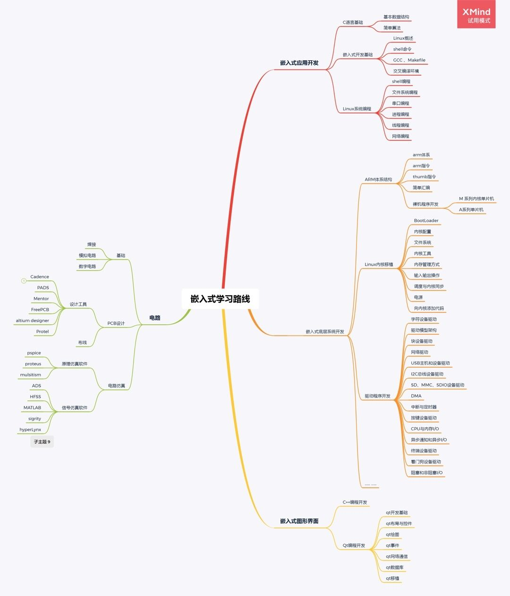
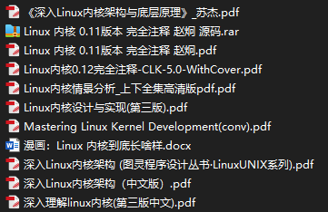

# 【主线剧情0.0】Linux 学习资源大综合

# Linux 学习资源大综合

对收集到的比较丰富的 Linux 学习相关的资料进行整理。注，如果链接挂了请告诉我，如果链接里的内容被删了那么直接搜文章名字试试也许会搜出来很多转载的 “备份”。

注：[在 Github 上的原版文章日后可能会更新](https://github.com/Staok/ARM-Linux-Study)，在其它位置发的不会跟进。[文章的 Gitee 仓库地址，Gitee 访问更流畅](https://gitee.com/staok/ARM-Linux-Study)。

------

## O 目录

[TOC]

------

## 1 尝鲜

### 前置基础

- C语言基础（可选的 数据结构与算法）。相关文章：
  - C语言基础 [【规范】C & MCU 编写规范和技巧](https://staok.github.io/软件规范/)，[CSDN](https://blog.csdn.net/Staokgo/article/details/122451567)。
  - 数据结构与算法 [（大集合）数据结构与算法简述和CS综合](https://staok.github.io/15数据结构与算法简述和cs综合/)，[CSDN](https://blog.csdn.net/Staokgo/article/details/122085252)。
- 单片机使用和理解的经验（对数模电、计算机结构 / 原理 / 总线 和 网络通讯 等 有认识）。（可选的）接触过 单片机平台的 小型实时操作系统（如 FreeRTOS、RTT、ucos 等）。相关文章：
  - 模电里的运放分析 [【手撕运放】运放的“第一原理”式定量分析法 - 知乎 (zhihu.com)](https://zhuanlan.zhihu.com/p/438051082)，[CSDN](https://blog.csdn.net/Staokgo/article/details/122010699)。
  - 嵌入式方向学习的基本路线 [【目录贴】软硬件规范化 - 知乎 (zhihu.com)](https://zhuanlan.zhihu.com/p/360100358)，[CSDN](https://blog.csdn.net/Staokgo/article/details/122649688)。
  - 单片机如何学习 [超快 STM32 系统入门指南 - 知乎 (zhihu.com)](https://zhuanlan.zhihu.com/p/406496862)，[CSDN](https://blog.csdn.net/Staokgo/article/details/121924333)。
  - 对 ARM Cortex-A 系列处理器的概念了解 [【主线剧情 番外01】ARM & SOC 系列快速鸟瞰 - 知乎 (zhihu.com)](https://zhuanlan.zhihu.com/p/369245951)。
  - （选看）ARM Cortex-A 系列处理器的 裸机编程 [【主线剧情01】ARM IMX6ULL 基础学习记录](https://staok.github.io/主线剧情01-arm-imx6ull基础学习记录/)，[【主线剧情01】ARM & i.MX6ULL 基础学习记录 - 知乎 (zhihu.com)](https://zhuanlan.zhihu.com/p/362115513)，[CSDN](https://blog.csdn.net/Staokgo/article/details/123430589)，[Gitee仓库](https://gitee.com/staok/ARM-Linux-Study)。
- Linux 系统的概念、使用，常用命令、Vim、GCC、Make、包管理等，基本的 编译工具链获取，应用、内核等的编译的概念。相关文章：
  - [【主线剧情02】ARM Linux 基础学习记录](https://staok.github.io/主线剧情02-arm-linux基础学习记录/)，[【主线剧情02】ARM & Linux 基础学习记录 - 知乎 (zhihu.com)](https://zhuanlan.zhihu.com/p/363051138)，[CSDN](https://blog.csdn.net/Staokgo/article/details/123693110)，[Gitee仓库](https://gitee.com/staok/ARM-Linux-Study)。

### 计算机组成原理

- [计算机组成原理 - 知乎 (zhihu.com)](https://www.zhihu.com/column/c_1589905431551574016)。
  - [一文搞懂CPU的工作原理 - 知乎 (zhihu.com)](https://zhuanlan.zhihu.com/p/589178906)。
  - [一文搞懂cpu cache工作原理 - 知乎 (zhihu.com)](https://zhuanlan.zhihu.com/p/593016449)。
  - [一文搞懂Cortex-A77（ARMv8架构）工作原理 - 知乎 (zhihu.com)](https://zhuanlan.zhihu.com/p/594532014)。
  - [一文搞懂GICv3中断控制器的工作原理 - 知乎 (zhihu.com)](https://zhuanlan.zhihu.com/p/601530596)。
- [ARM的Cortex-M3和M4里的main stack和process stack是个什么概念？ - 知乎 (zhihu.com)](https://www.zhihu.com/question/34914515/answer/2367330784) 详解了 M3 内核 的异常处理过程。

### 路线的内容

**总的来说（按顺序）**

1. 前置基础打牢（参考 前面的 “前置基础” 一节）。
2. Linux 应用编程（文件IO、内存管理、多任务编程（进程和线程）、网络编程 和 图形界面QT 等）。细节内容见 “Linux 应用编程内容补充” 一节。
3. Linux 驱动编程（字符设备、块设备、网络设备、总线设备 等）。细节内容见 “Linux 驱动编程内容补充” 一节。

**深入层面**

- 内核研读。
- 音频，视频子系统。
- Linux 移植（uboot + kernel + rootfs 的 配置和编译 等）。比较深而且由于工作的细分工可能用的不多。
- 等等。

## 2 网络资料收集整理

图片都有水印，侵删。

#### 路线相关

0、

- [韦东山：6000字长文告诉你如何学习linux (qq.com)](https://mp.weixin.qq.com/s/ZrPdNUAjUxMawKby8a9Ecg)。
- [Linux系统编程和网络编程的参考书籍 (0xffffff.org)](http://faq.0xffffff.org/daily/2014/05/30/the-book-about-network-programing/)。

1、清华远见教程的路线图。

2、一张网图（侵删）。

3、一张超大图，非常丰富的内容罗列：[嵌入式：我不是针对谁，我是说在座的Javaer都是弟弟，尤其程序羊 (qq.com)](https://mp.weixin.qq.com/s/AJqbhz3InV3G8TVjTHn6dg)，原图在 Github 仓库里 [rd2coding/Road2Coding: 编程之路 (github.com)](https://github.com/rd2coding/Road2Coding)。 下面是概略截图，高清原图看上面的链接。

梳理（含书籍推荐）.png)

4、一些介绍 学习路线 的 杂网文。

- [ARM+LINUX嵌入式学习路线 (qq.com)](https://mp.weixin.qq.com/s/DRnmVG-gkLgzmclauexjpw)。
- [学技术不难，重要的是怎么规划，给嵌入式开发的你一个目标 (qq.com)](https://mp.weixin.qq.com/s/FyaRRDpS-wZxVuAT1GoCbg)。
- [17000字嵌入式系统基础知识总结，太全啦！ - 知乎 (zhihu.com)](https://zhuanlan.zhihu.com/p/165039175)。
- [成为一名嵌入式高手，必备的技能清单和升级线路图_Linux (sohu.com)](https://www.sohu.com/a/298604443_505803)。
- [嵌入式Linux+Android学习路线图 (qq.com)](https://mp.weixin.qq.com/s?__biz=MzAxNTAyOTczMw==&mid=501844459&idx=1&sn=6dfc56db58b078461c1526a9a5753e23#rd)。
- [正点原子左忠凯的Linux学习之路_ 哔哩哔哩 _bilibili](https://www.bilibili.com/video/BV1dE411j7sc)。

#### **!学习来源!**

下面仅为个人见到的选择的推荐，欢迎补充！

最推荐的就是 “入手开发板，跟着教程学” 的方式即可~

- 韦东山 的 系列教程，靠谱而较全面，跟着走就成。
  - [Linux 学习 B 站视频](https://space.bilibili.com/275908810/channel/seriesdetail?sid=1714177)。
  - [百问网 资源下载站](http://download.100ask.org/)。推荐 跟着这个开发板学 [🎫100ASK_IMX6ULL_PRO开发板](http://download.100ask.org/boards/Nxp/100ask_imx6ull_pro/index.html)。
  - [百问网论坛](https://forums.100ask.net/)。

- 正点原子/野火 的 Linux 系列教程，靠谱而较全面，跟着走就成。
  - [正点原子 Linux 学习 B 站视频](https://space.bilibili.com/394620890/channel/seriesdetail?sid=2042045)，[正点原子 资源下载站](http://www.openedv.com/docs/index.html)，[论坛](http://www.openedv.com/docs/index.html)。
  - [野火 Linux 学习 B站视频](https://space.bilibili.com/356820657/channel/seriesdetail?sid=1702001)，[野火 资源下载站](https://doc.embedfire.com/products/link/zh/latest/index.html)，[论坛](https://www.firebbs.cn/)。

- 买书（驱动和应用），参考 下面 “书籍推荐” 一节。

- 其它 嵌入式 Linux 开发板 和 资料 的提供商，他们都提供了开发板配套的较完整的 SDK 和 硬件方案，对于开发的参考价值极大。
  - [百问网 Linux 板 产品页](http://www.100ask.org/LinuxBoard/) & [米尔 Linux 板 产品页](http://www.myir-tech.com/product/index.asp?anclassid=100)。
  - [Firefly | 让科技更简单，让生活更智能 (t-firefly.com)](https://wiki.t-firefly.com/)。
  - [Orange Pi PC - 香橙派](http://www.orangepi.cn/orangepipc/index_cn.html)。

- 看官方 doc：[怎样成为一名优秀的Linux驱动设备工程师？ - 知乎 (zhihu.com)](https://www.zhihu.com/question/302236329/answer/3027444921)。

  - Linux内核文档：[The Linux Kernel documentation — The Linux Kernel documentation](https://www.kernel.org/doc/html/latest/index.html)。

    Linux设备驱动程序开发指南：[Driver implementer's API guide — The Linux Kernel documentation](https://www.kernel.org/doc/html/latest/driver-api/)。

    Linux内核api：[Core API Documentation — The Linux Kernel documentation](https://www.kernel.org/doc/html/latest/core-api/index.html)。

  - 非官方的推荐<Linux 内核模块编程指南>：[The Linux Kernel Module Programming Guide (sysprog21.github.io)](https://sysprog21.github.io/lkmpg/)。

就这些，我不会列成吨的资料骑脸。。

#### 书籍推荐

注，书一般都是大**厚**书，要 入门学习 推荐参考上面 “！！！学习来源！！！” 一节里的，看书一般是 **复习知识**、**查漏补缺** 和 **用时现查** 用的。

1、网络推荐

2、引自 [coding-style-and-more: C 编写规范和其他。CC-BY-NC-SA 4.0。 (gitee.com)](https://gitee.com/staok/coding-style-and-more)。这些又都是典型的大厚书。

> 引自网络，侵删。
>
> - 算法和数据结构：数组、链表、二叉树、堆栈、排序算法、B+/B-树、DP（动态规划）等；
> - 操作系统：IO、存储器、多线程/多进程、同步机制、处理器调度及死锁、设备管理、通道等；
> - 计算机组成原理：冯诺依曼计算机组成、计算机层次结构、计算机性能指标等；
> - 网络底层：HTTP、HTTPS、DNS、ARP、TCP、IP、ICMP、UDP、FTP、SMTP、的实现底层；
> - 多进程/多线程编程：进程通信的方式（共享内存、pipe、Socket编程等）、同步、死锁及解决方案、线程池的实现、进程/线程的操作系统实现原理、进程的状态及切换和调度等。

- [《嵌入式C语言的自我修养》](https://book.douban.com/subject/35446929/) 从沙子讲到CPU，从编辑器讲到编译器，从高阶C语言讲到内存管理，从GNU讲到多任务编程。
- 《计算机体系结构》（经典），《计算机操作系统》/《现代操作系统》/《深入理解计算机系统》。
- 《编码的奥秘》，相关介绍/推荐 [想练习《编码的奥秘》里面的知识，有什么软件有帮助？ - 知乎 (zhihu.com)](https://www.zhihu.com/question/28223767)。《编译原理》（经典），《深入分析GCC》。
- 网络协议如《计算机网络》、《TCP-IP详解卷一/卷二/卷三》，[ 想深入了解 HTTP 协议，有哪些值得推荐的书籍？ - 知乎 (zhihu.com)](https://www.zhihu.com/question/19722062)。
- 嵌入式应用相关：《GNU Make》，《Debugging with GDB》，《Linux 高级程序开发》，《POSIX 多线程程序设计》，《嵌入式Linux基础教程》，《嵌入式Linxu应用开发完全手册》，《嵌入式Linxu应用程序开发详解》。
- 嵌入式底层相关：内核相关：《深入理解Linux内核》，《Linux内核源代码情景分析》，《Linux内核设计与实现》；驱动相关：《Linux设备驱动程序》，《Linux设备驱动开发详解》，《Linux驱动开发入门与实践》。

3、**Linux 驱动开发相关书籍**

- [linux内核和驱动开发，有什么经典的书籍推荐吗？ - 知乎 (zhihu.com)](https://www.zhihu.com/question/19846920)。
- [想成为 Linux 驱动工程师，需要读些什么书？ - 知乎 (zhihu.com)](https://www.zhihu.com/question/19941904)
- [嵌入式软件开发必看书籍推荐（C/C++/linux/软件） - 知乎 (zhihu.com)](https://zhuanlan.zhihu.com/p/144662649)。
- 大家都一下推荐成吨的书，这么多书中，总得选一两个，个人觉得目前有口碑、属经典、比较常见的是这两个：经典的 LDD《Linux Device Drivers》和 有国内有口碑的 《Linux设备驱动开发详解-宋宝华》。

#### 面经相关

部分引自 [coding-style-and-more: C 编写规范和其他。CC-BY-NC-SA 4.0。 (gitee.com)](https://gitee.com/staok/coding-style-and-more)。

**嵌入式相关**

- EmbeddedSoftwareEngineerInterview：[ZhongYi-LinuxDriverDev/EmbeddedSoftwareEngineerInterview: 嵌入式软件工程师笔试面试指南，主要收录笔试面试八股文。包括C/C++，计算机基础，操作系统，Linux驱动，Arm体系与架构，网络编程，大厂笔试面试题等。持续更新中~~有问题可以加我微信，LinuxDriverDev (github.com)](https://github.com/ZhongYi-LinuxDriverDev/EmbeddedSoftwareEngineerInterview)。
- embedded-notes：[xiaowenxia/embedded-notes: 嵌入式linux软件开发、嵌入式linux驱动开发、c语言、单片机开发、IOT开发等面试要点记录 (github.com)](https://github.com/xiaowenxia/embedded-notes)。

**一些文章**

- [从事嵌入式行业的你，现在年薪多少，有什么经历想和大家分享？ - 知乎 (zhihu.com)](https://www.zhihu.com/question/55453399/answer/1847544192)。
- [嵌入式面试题，不断更新 - 知乎 (zhihu.com)](https://zhuanlan.zhihu.com/p/338821919)。
- [嵌入式软件工程师笔试面试指南 - 知乎 (zhihu.com)](https://www.zhihu.com/column/c_1366086412383600640)。
- [2020年嵌入式软件秋招的一点经验和对嵌入式软件未来的一点思考 - 知乎 (zhihu.com)](https://zhuanlan.zhihu.com/p/260516266)。

**算法相关**

- hello-algorithm 基础、刷题、面经和汇总 [geekxh/hello-algorithm: 🌍 针对小白的算法训练 | 包括四部分：①.算法基础 ②.力扣图解 ③.大厂面经 ④.CS_汇总 | 附：1、千本开源电子书 2、百张技术思维导图（项目花了上百小时，希望可以点 star 支持，🌹感谢~） (github.com)](https://github.com/geekxh/hello-algorithm)。网站版 [小浩算法 (geekxh.com)](https://www.geekxh.com/)。
- CS-Notes 算法和刷题、操作系统、网络、数据库、系统设计等 [CyC2018/CS-Notes: 技术面试必备基础知识、Leetcode、计算机操作系统、计算机网络、系统设计 (github.com)](https://github.com/CyC2018/CS-Notes)。网站版 [CS-Notes (cyc2018.xyz)](http://www.cyc2018.xyz/)。
- LeetCode C++ 题解：[soulmachine/leetcode: LeetCode题解，151道题完整版 (github.com)](https://github.com/soulmachine/leetcode)。

#### 内核研读

**一些基础概念**

- [Linux内核的五大模块_~青萍之末~的博客-CSDN博客_linux内核模块](https://blog.csdn.net/daaikuaichuan/article/details/82957655)，进程调度，进程间通信模块（包括管道、命名管道、消息队列、信号量和共享内存等），内存管理模块，文件系统模块，网络接口模块。[Linux内核四大核心框架 - 知乎 (zhihu.com)](https://zhuanlan.zhihu.com/p/406242811)。
- [Linux系统相关的基础问题（空间、内存、库、链接、环境变量）_~青萍之末~的博客-CSDN博客](https://blog.csdn.net/daaikuaichuan/article/details/82729483)。[Linux系统调用_~青萍之末~的博客-CSDN博客_linux系统调用](https://blog.csdn.net/daaikuaichuan/article/details/82902407)。
- [Linux调度系统全景指南(终结篇) (qq.com)](https://mp.weixin.qq.com/s/Bo4z5HorF7jwpcQ0eXuYiQ)。
- [Linux与SoC - 知乎 (zhihu.com)](https://www.zhihu.com/people/ming-yue-spy/posts)。
- [《Linux内核设计与实现》读书笔记 - 目录 （完结） - wang_yb - 博客园 (cnblogs.com)](https://www.cnblogs.com/wang_yb/p/3514730.html)。[《Linux内核设计与实现》读书笔记 - 知乎 (zhihu.com)](https://zhuanlan.zhihu.com/p/70958648)。

**深入研读**

- linux_kernel_wiki：Linux 内核知识体系与面试题 [0voice/linux_kernel_wiki: linux内核学习资料：200+经典内核文章，100+内核论文，50+内核项目，500+内核面试题，80+内核视频 (github.com)](https://github.com/0voice/linux_kernel_wiki)。

- linux-insides-zh：[MintCN/linux-insides-zh: Linux 内核揭秘 (github.com)](https://github.com/MintCN/linux-insides-zh)。网站版 [简介 · Linux ­Insides­中文 (gitbooks.io)](https://xinqiu.gitbooks.io/linux-insides-cn/content/index.html)。

- [腾讯首发Linux内核源码《嵌入式开发进阶笔记》差距差的不止一点点哦 - 知乎 (zhihu.com)](https://zhuanlan.zhihu.com/p/465789157)。

- [Linux 2.6.12代码注释: 包含LINUX内核同步、信号、内存、调度、文件系统、网络系统、时钟等部分的源码注释。前后历时三年，算是干货。 (gitee.com)](https://gitee.com/xiebaoyou/linux-2.6.12)。

- [sunym1993/flash-linux0.11-talk: 你管这破玩意叫操作系统源码 — 像小说一样品读 Linux 0.11 核心代码 (github.com)](https://github.com/sunym1993/flash-linux0.11-talk)。

- Linux 内核相关书籍，自行网搜即可。

  

#### 网络杂文

网上东西非常杂，这里会推荐一些我个人见到的好的。

- [关于嵌入式开发的经验之谈 - 知乎 (zhihu.com)](https://zhuanlan.zhihu.com/p/330979589)，一些基础概念。
- [程序员必知的 89 个操作系统核心概念 (qq.com)](https://mp.weixin.qq.com/s/Ik-4_iQuPla4jTRk9G-cCg)，一些基础概念。
- 图解系统 小林。[如何看待程序员持续写技术博客？ - 知乎 (zhihu.com)](https://www.zhihu.com/question/41802793/answer/2153693554)，拉到下面有文章合集。
- 网络相关：图解网络 小林。[趣谈网络协议](https://book.douban.com/subject/35013753/)。手绘图解HTTP。30张图解HTTP常见面试题。[TCP/IP 教程 | 菜鸟教程 (runoob.com)](https://www.runoob.com/tcpip/tcpip-tutorial.html)。[HTTP 教程 | 菜鸟教程 (runoob.com)](https://www.runoob.com/http/http-tutorial.html)。
- [简直不要太硬了！一文带你彻底理解文件系统 (qq.com)](https://mp.weixin.qq.com/s/j5Yy-ImpUz2_s1zLzMFGTQ)。
- [Linux网络编程_~青萍之末~的博客-CSDN博客](https://blog.csdn.net/daaikuaichuan/category_7980354.html)。
- [Linux系统编程_~青萍之末~的博客-CSDN博客](https://blog.csdn.net/daaikuaichuan/category_7980351.html)。
- [Linux学习资料整理 - 知乎 (zhihu.com)](https://zhuanlan.zhihu.com/p/448881010)，是一些零散的视频。
- [0voice/backend_video: 后端免费技术分享视频，包含Linux，RTSP RTMP, HLS, 流媒体, ffmpeg, WebRTC,golang,Nginx，ZeroMQ，MySQL，Redis，fastdfs，MongoDB，ZK，CDN，P2P，K8S，Docker，ffmpeg，TCP/IP，协程，DPDK (github.com)](https://github.com/0voice/backend_video)，是一些零散的视频。
- [宅学部落-王利涛 - 知乎 (zhihu.com)](https://www.zhihu.com/people/zhaixuebuluo-1986/columns)，是一些零散的文章。
- [归档 | 浅墨的部落格 (0xffffff.org)](https://www.0xffffff.org/archives/)，是一些零散的文章。
- [百问科技 精选文章汇总(更新时间2020年12月10日) (qq.com)](https://mp.weixin.qq.com/s/urZ72HjBrpWdjstDN1suRg)，是一些零散的文章。
- [Arm®核心板_ 工控板 _开发板技术专题-广州致远电子有限公司 (zlg.cn)](https://www.zlg.cn/ipc/article/jszt.html)，是一些零散的文章。

休闲阅读 [Linux的功能有多强大？ - 知乎 (zhihu.com)](https://www.zhihu.com/question/397371213)。

## Linux 应用编程内容补充

基本：

- 韦东山、正点原子、野火 等 的 Linux 学习文档。

综合：

- [百问网-优秀学员-嵌入式开发学习笔记汇总](http://studynotes.100ask.net/)。
- [Linux C编程一站式学习 (akaedu.github.io)](https://akaedu.github.io/book/)。
- [亚嵌教育 (akaedu.github.io)](https://akaedu.github.io/)。

I/O编程：

- [Linux应用开发_Top嵌入式的博客-CSDN博客](https://blog.csdn.net/qq_45396672/category_11169831.html)。
- [深入理解 Linux I/O 系统 (qq.com)](https://mp.weixin.qq.com/s/iRfq1Xs_0Ia3-OUmTpyKuw)。

misc：

- 清华远见-嵌入式Linux应用程序开发详解。
- Linux系统编程_ 中文版 _ by _哈工大。
- POSIX多线程程序设计。
- [宅学部落的个人空间_哔哩哔哩_bilibili](https://space.bilibili.com/382223675/channel/series)。

下面引自 《主线剧情08-Linux应用编程-学习总结备查》：

> 这里就是日常用到的 API 的积累和整理，最详细、全面的 API 参考 见 上面 `通过手册的 API 详细描述参考` 一节。
>
> 日常用到的 标准 API 富集 单独放在了 `【Linux 通用应用开发】` （**仓库地址 [Github](https://github.com/Staok/ARM-Linux-Study)、[Gitee](https://gitee.com/staok/ARM-Linux-Study)**）文件夹 里面，包括：
>
> - 文件 IO、字符流收发 和 字符串处理相关的 API 收集积累。
>
> - 一些 Shell 命令 API 收集积累。
>
> - 输入设备框架，读取驱动程序按照 input event 框架上传的信息。
>
> - 文件 IO 读写的基本四种机制（阻塞、非阻塞、poll/select 和 异步通知（通过信号机制））。
>
> - Socket TCP / UDP 编程。
>
> - 进程 和 线程 的设计和编程。包括 进程和线程的分配策略、进程和线程的 API 用法 等：
>
>   - 进程 相关 API（fork()、exec、wait() 等等）。
>   - 进程间通讯（管道、命名管道、信号、信号量、消息队列、共享内存、内存映射 和 套接字）。
>   - pthread 线程编程库 相关 POSIX API（pthread_create()、（后面省略 “pthread_”）exit / cancel 和 join / tryjoin_np、self()、attr_setxxx() / attr_getxxx()、）。
>   - 线程间通讯、同步的机制（锁机制（互斥锁、读写锁 和 自旋锁）、信号量机制、条件变量机制 和 信号（与 IPC 的信号使用上有区别））。
>
> - 串口收发编程、I2C编程。
>
>   实质上就是对各种设备驱动文件 进行 open/read/write/ioctl/close 来配置和读写，有一些标准接口有标准的信息结构，因此有专门的 库，通过这些库来间接的 配置 和 读写设备驱动文件，比如 tslib、i2ctool 等等。
>
> - 等等其它，用时补充。比如 进程高级编程、内存管理、Linux 高并发编程 epoll 等等。

## Linux 驱动编程内容补充

基本：

- 韦东山、正点原子、野火 等 的 Linux 学习文档。
- [韦东山-嵌入式Linux驱动难？到底难在哪？ - 百问网嵌入式问答社区 (100ask.net)](http://bbs.100ask.net/article/50)。
- [【第5篇】嵌入式Linux驱动开发基础知识_ 哔哩哔哩 _bilibili](https://www.bilibili.com/video/BV14f4y1Q7ti) 新视频。
- [韦东山嵌入式Linux驱动入门_ 字符设备驱动详解_ 哔哩哔哩_bilibili](https://www.bilibili.com/video/BV1pW411L7MP) 老视频。
- 前面 “书籍推荐” 一节 里面的推荐。
- [宅学部落的个人空间_哔哩哔哩_bilibili](https://space.bilibili.com/382223675/channel/series)。

备查：

- [Linux内核API|极客笔记 (deepinout.com)](https://deepinout.com/linux-kernel-api) 比较全-备查。

综合例子：

- [Linux设备模型_导航篇 - 知乎 (zhihu.com)](https://zhuanlan.zhihu.com/p/105764906)。[我的Linux设备驱动修炼之路V1 - 知乎 (zhihu.com)](https://www.zhihu.com/column/c_1187102635679862784)。
- [linux驱动编程_wangdapao12138的博客-CSDN博客](https://blog.csdn.net/wangdapao12138/category_7811645.html)。
- [#Linux 驱动 (qq.com)](https://mp.weixin.qq.com/mp/appmsgalbum?__biz=MzU3NDY4NTk3Mg==&action=getalbum&album_id=1378331497144664066&scene=173#wechat_redirect&scene=94&subscene=315&sessionid=0&enterid=1600008346)。
- [gatieme/LDD-LinuxDeviceDrivers: Linux内核与设备驱动程序学习笔记 (github.com)](https://github.com/gatieme/LDD-LinuxDeviceDrivers)。

Linux各子系统：

- [linux进程管理 - 知乎 (zhihu.com)](https://www.zhihu.com/column/c_1590850175677009920)。
- [linux内存管理 - 知乎 (zhihu.com)](https://www.zhihu.com/column/c_1605852580709560320)。
- [linux功耗管理 - 知乎 (zhihu.com)](https://www.zhihu.com/column/c_1589903721982472192)。

Linux驱动具体是指什么？引自 [Linux驱动具体是指什么？ (qq.com)](https://mp.weixin.qq.com/s/Wt9D8Sj4Dc4Jf7aksAWj6g)。

> **驱动的具体分类？**
>
> **1、驱动分类**
>
> (1)分3类：字符设备驱动、块设备驱动、网络设备驱动
>
> (2)分类原则：设备本身读写操作的特征差异
>
> 时刻要注意一点，我们的驱动本质上是不分类的，因为我们的硬件是不同的，有不同的读写特性，所以的硬件是分类的，所以我们的驱动也就要跟着分类了。
>
> **2、三类驱动程序详细对比分析**
>
> (1)字符设备，准确的说应该叫“字节设备”，软件操作设备时是以字节为单位进行的。典型的如LCD、串口、LED、蜂鸣器、触摸屏······
>
> (2)块设备，块设备是相对于字符设备定义的，块设备被软件操作时是以块（多个字节构成的一个单位）为单位的。设备的块大小是设备本身设计时定义好的，软件是不能去更
>
> 改的，不同设备的块大小可以不一样。常见的块设备都是存储类设备，如：硬盘、NandFlash、iNand、SD····操作块设备时，我们必须以块单位进行操作，将一块的
>
> 数据读取到内存中去，然后在内存中找到相应的那个字节数据修改之后再以一块的数据写入到我们的块设备中去。
>
> (3)网络设备，网络设备是专为网卡设计的驱动模型，linux中网络设备驱动主要目的是为了支持API中socket相关的那些函数工作。
>
> 
>
> **驱动的设计思想？**
>
> 1: 分离、分层思想
>
> 2: 驱动的上面是系统调用API
>
> 3: 驱动的下面是硬件
>
> 4: 驱动本身的实现也是基于分离、分层的思想
>
> 
>
> 
>
> **驱动和内核的关系？**
>
> 驱动已经成为内核中最庞大的组成部分
>
> 内核会直接以函数调用的方式调用驱动代码
>
> 驱动的动态安装和卸载都会“更改”内核
>
> 驱动程序崩溃甚至会导致内核崩溃
>
> 驱动的效率会影响内核的整体效率
>
> 驱动的漏洞会造成内核安全漏洞
>
> 

下面摘自网络，侵删。

> 　　1. 学会写简单的makefile
> 　　　2. 编一应用程序，可以用makefile跑起来
> 　　　3. 学会写驱动的makefile
> 　　　4. 写一简单char驱动，makefile编译通过，可以insmod, lsmod, rmmod. 在驱动的init函数里打印hello world, insmod后应该能够通过dmesg看到输出。
> 　　　5. 写一完整驱动， 加上read, write, ioctl, polling等各种函数的驱动实现。 在ioctl里完成从用户空间向内核空间传递结构体的实现。
> 　　　6. 写一block驱动， 加上read,write,ioctl,poll等各种函数实现。
> 　　　7. 简单学习下内存管理， 这个是最难的，明白各种memory alloc的函数实现细节。这是linux开发的基本功。
> 　　　8. 学习锁机制的应用，这个不是最难的但是最容易犯错的，涉及到很多同步和并发的问题。
> 　　　9. 看内核中实际应用的驱动代码。 你会发现最基本的你已经知道了， 大的框架都是一样的， 无非是read, write, ioctl等函数的实现， 但里面包含了很多很多细小的实现细节是之前不知道的。 这时候就要考虑到很多别的问题而不仅仅是基本功能的实现。
> 　　　推荐您看2.6.20中integrated的一个驱动 kvm， 记得是在driver/lguest下，很好玩的， 就是linux下的虚拟机驱动， 代码不长，但功能强大。有能力的可以自己写一操作系统按照要求做成磁盘镜像加载到虚拟机中， 然后客户机可以有自己的4G虚拟地址空间。
> 　　　10. 看完驱动欢迎您进入Linux kernel学习中来。
> 　　　最简单的方法，跟着ldd(linux devive driver)做一遍。

## 全栈之路

*p.s 只是总结着玩的*

- 自动控制原理&信号与系统&英语。
- 电路、数模电基础。
- 各类电路拓扑，各类电源、各类电机、各类接口、各类保护。
- 原理图&PCB绘制&绘制规范和技巧。
- 高速信号&信号完整性&电源完整性&EMC&射频天线。
- C/C++语言基础&编程规范&开发模式。
- MCU编程（各类外设，通讯接口，总线，USB）。
- RTOS编程&LWIP网络编程。
- 数据结构与算法（堆、栈、链、树、图；串匹配、排序、搜索、动态规划.etc）。
- 计算机体系结构，计算机操作系统，计算机网络，编译原理。
- Vim、GCC、Make、Git、APT。
- uboot、kernel、rootfs 的 编辑配置、移植、编译 和 源码研读。
- Linux驱动（字符设备、块设备、网络设备、总线设备 等）。
- Linux应用（文件IO、内存管理、多任务编程、网络编程 和 图形界面QT 等）。
- 音频应用，视频应用，摄像头，总线开发（每一块都是专家）。
- 机器学习，深度学习。
- 上位机。
- 前端/后端。
- 安全。

*p.s 术业有专攻*
