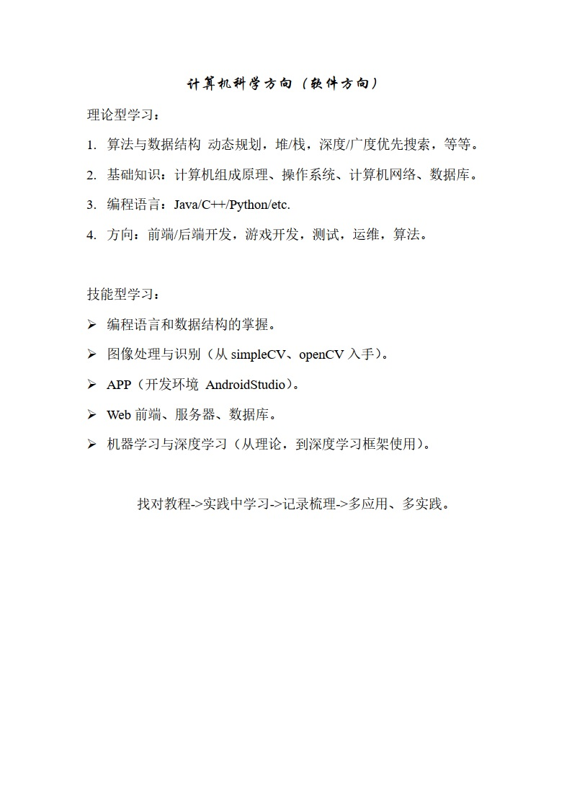
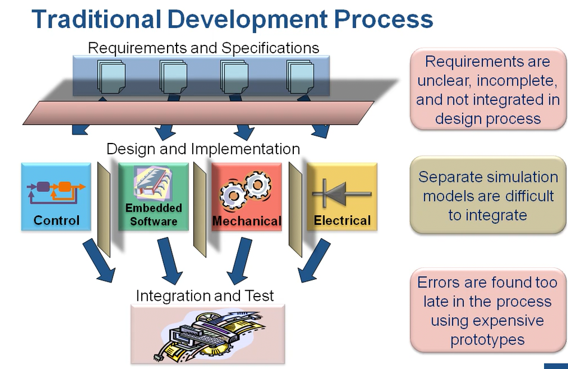
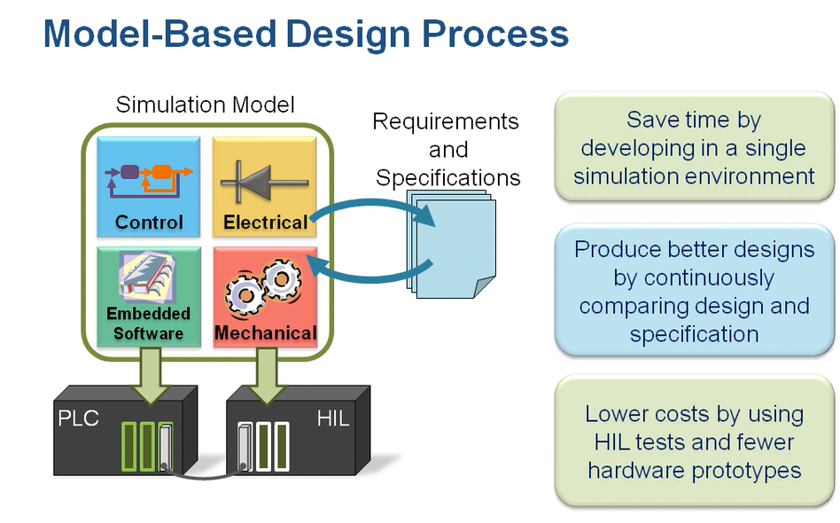

# 【目录贴】总览软硬件规范化的意义和内容

# 软硬件规范化（norm-of-software-and-hardware）

    

## 意义

不多言语，直接引用观视频工作室视频[【大师计划·林宝军03】北斗三号总师：我来跟你说说，...](https://www.bilibili.com/video/BV1BA411K7FJ)里面总师受访时所说的话：

> 5:48：“...所以我经常讲，要把一个产品做好，其实有三方面，一个是**技术**，一个是**质量**，一个是**管理**，这三方面；技术水平，质量保障能力和管理能力，三条腿哪个都少不了，少一个，这个东西（航天）也做不上去，其实技术只是一方面，...”
>
> 6:44：“...光是技术上去了，不见得能做出一个系统。对我们工程来讲，就是（需要）**规范的文化**，什么意思呢，比如我们几十年的航天经验，我把这个经验总结成文字，总结成规范，不管是谁做，只要有一定的经验，按这个规范做出来，做得卫星出来，打到天上去就能好用，这就是规范文化。包括匠人文化和规范文化，最后都是按规矩去做，它强调的是解决了怎么做的问题，但它有一个缺点，没强调为什么，其实我认为在做的过程中，**加个为什么可能更好**。”

规范在实用层面的意义：

- 编程框架固定；
- 标准组件重用；
- 注重应用开发；
- 快速且不易出错；
- 易于问题定位；
- 快速提高项目组水平。

在网上规范文章随处有的情况下，我为什么还要自己总结规范？因为每一个文章都不会是全的，就这么简单，我吸收、整理和合并它们，成为更全的，并在我以后自己的项目中遵守这些规范，实现更好的阅读性、操作性、解耦性、分层次性、模块化等，集百家之长，此乃瞰百易之精髓之一。

还有一件事，根据脑科学的一些研究结果，大脑中的记忆，尤其是以前发生的事情的细节，是会发生改动的，而细节的偏差会影响大局的择决；就从日常生活经验也能感觉出，这个结论有一定真实性，所以，把几乎所有的细节都放到大脑里是非常不靠谱的事。

有的人因为看见所以相信，而有的人，因为相信所以看见，我想，后者更具有价值和希望。

> “我一直认为，人类历史上最伟大最美妙的故事是通过科学讲出来的。科学所讲的故事，其宏伟壮丽、曲折幽深、惊悚诡异、恐怖神秘，甚全多愁善感，都远远超出文学故事。”
>

------

## 学习路径

本科阶段的嵌入式和计算机科学两个大方向的 短小精悍 的总结，在自己本科的实验室推广，效果拔群。

若要走嵌入式方向，尤其是嵌入式软件方向，“嵌入式方向-本科学习路线.docx” 文件中所描述的东西尽量在大三或毕业前全部熟悉一遍（FPGA部分为可选）；若要走计算机软件方向，“计算机科学-软件方向-本科学习路线.docx” 文件描述了推荐的基础和进阶部分的方向，应当广泛熟悉和学习。

若以才华待年华，匆匆岁月无足惜。

------

## 实践

经验之谈。

-   要高效的成体系收纳和运用，就要按照正确的学习路径和方法（可以参考 [我的回答](https://www.zhihu.com/question/465936066/answer/1950602532) 和 [文章](https://zhuanlan.zhihu.com/p/392532065) 或 [这个回答（人的一生到底该追求什么？）](https://www.zhihu.com/question/38869606/answer/1570796800) 找找启发）。目前以及将来一段时间 网上会 充斥着满屏口水话、抒情、矫情、写心情日记风格的 所谓的 经验贴 和 教程文章，还有无可救药的 碎片化 和 相互 “借鉴” 的 问题，不成系统，看多了会变得不幸，少看！看什么：正儿八经的 将 本科 高数、电路上下册、数/模电、自动控制原理、计算机系统 等等 相关的课本 从第一页一页一页地看到最后一页！依照 研究/做事 的领域，看经典或者全面的成系统的 文章 或 书籍（成系统的网络文章、大厂官网的教程手册、经典书籍都可以，一定要坚持），看书先看目录（有个大概认识和学习规划），做好整理和在脑海中形成节点与节点之间连线的网络，学新东西就像新入节点连接到已有的网络！到达前沿 则 多看论文。
-   开拓一个新领域，在找资料的阶段，可以去淘宝、咸鱼和拼多多等寻找资料，有时会碰到 很全的/整理好的，甚至瞬间解决大部分问题。
-   进军一个新领域，先找相关行业的"行业分析报告"。[在哪里能找到各行业的分析研究报告？](https://www.zhihu.com/question/19766160)。
-   项目组在开始一个全新的项目时，应尽量由经验多、规范意识好、能力最强的一些人谋划和开篇这个新项目，做的尽量高内聚、低耦合、可重用、注解全，并且日后易于维护和增改，如果能配上详细的手册就太好了，大家都喜闻乐见。相反的情况就是让初入茅庐的人建立地基，结果就是一地鸡毛、一团乱麻，搞的大家都不舒畅。
-   开始一个全新的项目时，应首先 全！网！ 收集相关资料、文献和参考设计；例如笔者在筹备 BLDC 原理图时，就全网收集了数十张原理图方案；经过交叉横向对比后，快速形成考虑比较多的、功能齐全的和子系统优选的更新进的方案出来。
-   许多问题应在设计时避免，除了吃透各种官方文档，还要多找一些 相同/类似 的设计进行横向对比，找它们的不同之处并搞清原因；还要考虑增加安全性的设计（防错、纠错和相应的处理，对用户的 傻瓜化操作设计 和 防傻防呆设计（防止乱用错用））、冗余性设计（多路冗余）和可调试性设计（留有可以调试和改动的余地）。
-   关于软、硬件的模块化，在上面《规范》文章中说到了一些，除了 “增加通用性” 并且使方案可模块化的 “拆解” 和 “拼装”，在此基础上还应考虑 “故障点隔离”，故障的节点（软件或者硬件）做相应处理，失效的节点做隔离/孤立处理，这个往往需要软硬件协调的设计。
-   ...

------

## 内容

以下链接中，括号内的为 知乎 和 CSDN 文章地址，其他链接为 GitHub 仓库地址。

-   软件框架，规范化。
    1.  [关于 C & MCU 的规范](https://github.com/Staok/coding-style-and-more)（[C & MCU编写规范和其他](https://zhuanlan.zhihu.com/p/350839857)、[【规范】万字集大成的C编写规范_瞰百-CSDN博客](https://blog.csdn.net/Staokgo/article/details/122451567)）（"低耦合，可重用，参数化，注释全"）。
    2.  [关于 HDL & FPGA 的学习和规范](https://github.com/Staok/HDL-FPGA-study-and-norms)（[FPGA & HDL 学习和规范](https://zhuanlan.zhihu.com/p/356856108)、[【规范】万字集大成的HDL&FPGA学习和规范_瞰百-CSDN博客](https://blog.csdn.net/Staokgo/article/details/122636023)）。
    3.  [MCU Framework 项目](https://github.com/Staok/stm32_framework)。
    4.  [IMU 选型和算法](https://github.com/Staok/IMU-study)。
    5.  [Awesome-K210](https://github.com/Staok/Awesome-K210)。
    6.  [开源协议汇总和选择](https://github.com/Staok/Public-License-List)。
    7.  [Awesome-Embeded-AI](https://github.com/Staok/Awesome-Embeded-AI)。
    8.  [ARM-Linux-Study](https://github.com/Staok/ARM-Linux-Study)。
-   硬件模块，规范化。
    1.  [硬件规范](https://github.com/Staok/thoughs-about-hardware-design)（[SCH & PCB 设计规范和 AD 的使用](https://zhuanlan.zhihu.com/p/356679916)、[【规范】万字集大成的SCH&PCB设计规范和AD的使用_瞰百-CSDN博客](https://blog.csdn.net/Staokgo/article/details/122589735)）。
    2.  [开源开关电源项目](https://github.com/Staok/PowerBar) （[【开源电源】巧克力板](https://zhuanlan.zhihu.com/p/357497672)、[【开源项目】叠buff电源板-巧克力板_瞰百-CSDN博客](https://blog.csdn.net/Staokgo/article/details/121871227)）。
    3.  [开源 BLDC FOC 项目](https://github.com/Staok/iBLDC)（更新会超级慢）。
    4.  [硬件保护项和措施](https://github.com/Staok/protection-circuits)。
-   硬件测试的指标条目、每个项目的测试步骤和测试报告，规范化。[请戳这里](https://github.com/Staok/thoughs-about-hardware-design/blob/master/SCH%20%26%20PCB%20%E8%AE%BE%E8%AE%A1%E8%A7%84%E8%8C%83%E5%92%8C%20AD%20%E7%9A%84%E4%BD%BF%E7%94%A8.md#15-%E7%A1%AC%E4%BB%B6%E6%B5%8B%E8%AF%95%E8%A7%84%E8%8C%83%E5%8C%96)（暂无）。

这些是我本科阶段触及的一部分（不是所有，本科玩的东西真多...字面意义的玩，不深入）领域及其顺延的小总结。下一篇就是硕士阶段的触及领域及其顺延的大总结了，内容定将极其多。

------

## 远景

### 关于软硬件标准化

这是 ZLG致远电子 在2018年的一篇肺腑文章。

>   开发者的最大问题是核心域和非核心域不分，大部分时间都在编写不可重用的非核心域的代码。没有聚焦提升产品竞争力的核心域知识，比如，需求、算法、用户体验和软件工程方法等方面，从而导致代码维护的成本远远大于初期的开发投入。
>
>   事实上，那些做出优秀产品的团队，不仅员工队伍非常稳定，而且收入也很高，甚至连精神面貌都不一样。因为他们使用了正确的开发策略和方法，而且短时间内掌握的技术远胜于那些所谓的“老程序员”。虽然每个企业都有拿高薪的员工，但为何不是你？别人开发的产品大卖，而你开发的产品却卖不掉？不仅浪费了来之不易的资金，而且导致我们失去了更多的创造更大价值的机会。
>
>   十几年前，作者也面临同样的问题，于是毫不犹豫地投身于软硬件标准化平台技术的开发，因为只有方法的突破才能开创未来。AWorks就是在这样的背景下诞生的，定义了外围器件的软件接口标准，“按需定制”为用户提供有价值的服务也就成为了现实。
>
>   基于此，ZLG为用户提供了大量标准的外设驱动与相关的协议组件，意在建立完整的生态系统。无论你选择什么MCU，只要支持AWorks，都可实现“一次编程、终生使用”，其好处是你再也不要重新发明轮子。

### 框图<—>仿真<—>实物

规范化的下一步，是包括软硬件的模块固定化，标准化设计资料（模块、内部结构和接口等标准化），往后的开发专注于框图设计和模块连接，用软件工具从框图直接生成代码，部署到硬件，这是早就开始的（2、30年前）时代趋势。所以巩固基础，按照规范，多做原创性设计，或者就个人而言，整条链路上下打通，做各个环节的细节和全环节的掌握。

### 设计工具

了解到，遇到新问题或新科研，看最新论文动向、行业报告等，收集需求和思考痛点，先进的科研往往先设计工具，或者备好工具和生产资料，再用工具做应用；而大多的企事业和科研单位，往往是在做应用。

### 基于模型的设计研发

[以下图片的出处](https://ww2.mathworks.cn/videos/model-based-design-of-a-wind-turbine-81625.html?type=large)

传统研发如下图概括。

新理念（早已经不新了）如下图，基于模型的设计研发（Model-Based Design Process）。

这个基于模型的设计研发根据 “需求 & 设计文件” 构建全模拟系统（包括控制、嵌入式、机械和电力电子等），相当于对未来的实物先构建一个 “数字孪生”，在模拟环境中看现象、定参数和找问题等，在 Matlab 中可以更多的做到 从模型生成设计文件、从设计文件生成模型、生成 C 代码，可视化物理仿真等等。

启发：

- 一个被控对象的非线性模型，先线性化得到一个 LTI 线性时不变模型（状态方程或传递函数），用传统控制理论中的方法（根轨迹、伯德图校正等）得到一组控制器的具体参数（如 PID），并留有较多的相位、幅度裕量，然后再把这些参数带入到非线性模块所在环路的控制器里面再仿真模拟；若裕度不够，则在非线性模型的仿真中会性能显著降低甚至不稳定。
- 控制系统仿真模拟时：
  - 要么模型建的非常精准；
  - 要么控制器的兼容性、容错性、鲁棒性等很强。
- 自动生成报表，自动测试。可以自己写一些自动化工具软件替代重复性工作，多做通用性工作。

